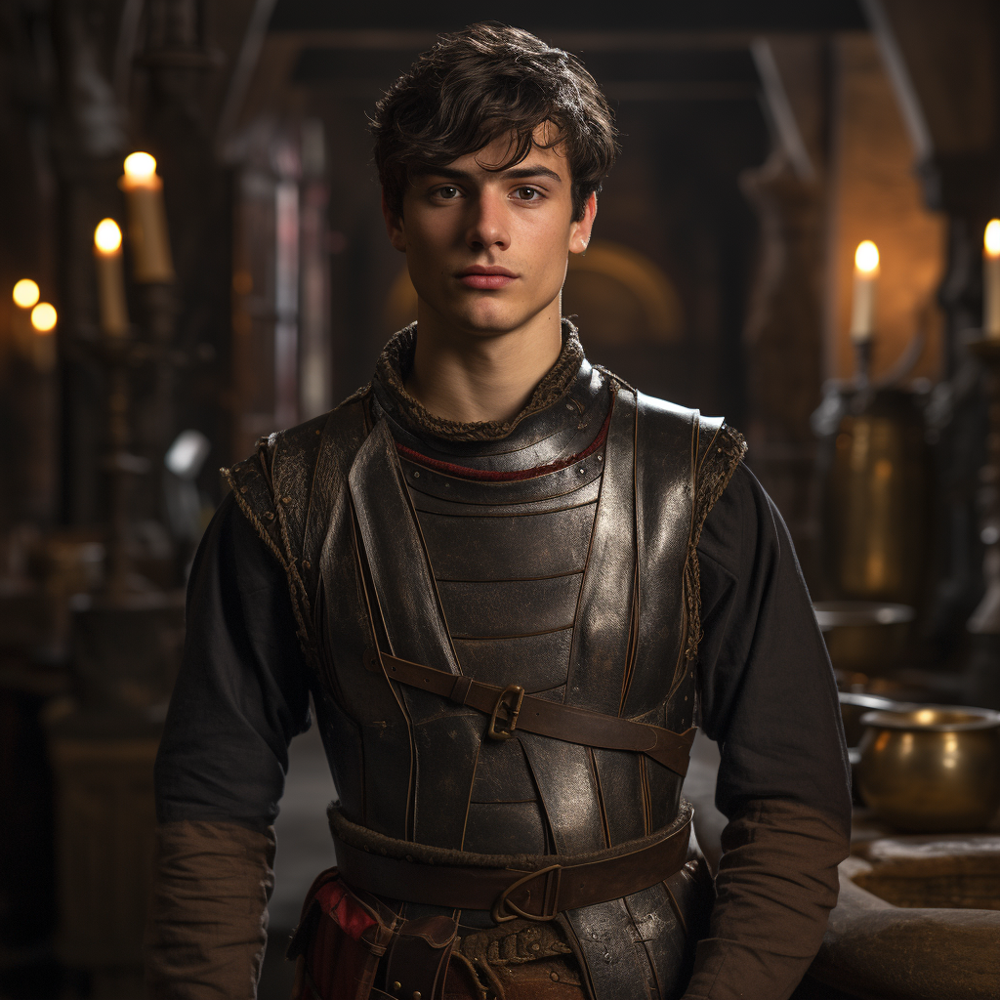
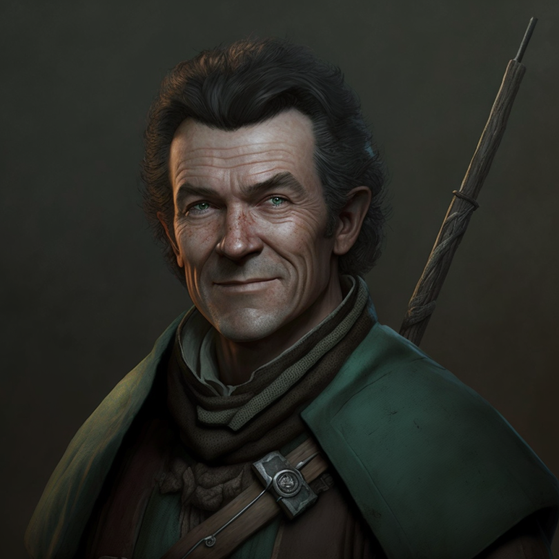

The Cleenseau region is home to a population of about 2300 people, mostly humans with some lizardfolk and halflings as well. This outlines the major NPCs the party knows in the region.

## Cleenseau

### The Essford Family
The Essford family have been the lords of the [Manor of Cleenseau](<../../gazetteer/greater-sembara/sembara/barony-of-aveil/cleenseau-region/manor-of-cleenseau.md>) for 70 years, since [Reginald Essford](<../../people/historical-figures/reginald-essford.md>) was granted the manor as a reward for his service in the [hobgoblin wars](<../../history/third-hobgoblin-war-sembara.md>). They are the most prominent nobles in the region, and despite having no formal authority over the other three manors, exert influence over the whole region.

The family consists of:

 - {align="left"; width="120"}[Rosalind Essford](<../../people/sembarans/rosalind-essford.md>), the *defacto* lord of the [Manor of Cleenseau](<../../gazetteer/greater-sembara/sembara/barony-of-aveil/cleenseau-region/manor-of-cleenseau.md>), currently traveling to [Embry](<../../gazetteer/greater-sembara/sembara/heartlands/embry.md>)
 - {align="left"; width="120"} [Wymar Essford](<../../people/sembarans/wymar-essford.md>), Rosalind's father, senile and bedridden
 - {align="left"; width="120"} [Rinault Essford](<../../people/sembarans/rinault-essford.md>), Rosalind's brother, a hothead, unmarried and without children
 - {align="left"; width="120"} [Arthur Essford](<../../people/sembarans/arthur-essford.md>), Rosalind's husband, of the Bybet family, currently traveling with his wife

And their retainers and servants:

 - {align="left"; width="120"}  [Annet Bybet](<../../people/sembarans/annet-bybet.md>), Arthur's cousin, and the chamberlain of Essford Manor, currently traveling with Rosalind
 - {align="left"; width="120"}  [Harold Bybet](<../../people/sembarans/harold-bybet.md>), Annet's husband and a childhood friend of Rinault's. Did not go to Embry with his wife.
 - {align="left"; width="120"}  [Eremon](<../../people/sembarans/eremon.md>), a acolyte of the Night Queen and confidant and advisor to Rosalind, currently traveling with Rosalind
 - {align="left"; width="120"} [Ames Benthey](<../../people/sembarans/ames-benthey.md>), the captain of the household guard, currently traveling with Rosalind
 - {align="left"; width="120"}  [Jonathon Henwyn](<../../people/sembarans/jonathon-henwyn.md>), the steward of Essford manor, with his wife, and their three young children
 - {align="left"; width="120"}  [Genevote](<../../people/sembarans/genevote.md>), the stablemaster of Essford Manor
 - {align="left"; width="120"}  [Yvette](<../../people/sembarans/yvette.md>), the caretaker and nurse for Wymar, recently a cook. She tends the small shrine to the Night Queen in the manor, in Eremon's absence

### The Town Watch

Order is kept in town by the magistrate and the [Lord's Guard of Cleenseau](<../../gazetteer/greater-sembara/sembara/barony-of-aveil/cleenseau-region/cleenseau/lord-s-guard-of-cleenseau.md>)

 - {align="left"; width="120"} [Nicholas Wysson](<../../people/sembarans/nicholas-wysson.md>), the young town magistrate
 - {align="left"; width="120"} [Ysabel](<../../people/sembarans/ysabel.md>), the old sheriff, recently killed by zombies
 - {align="left"; width="120"} [Béatrix Thorne](<../../people/sembarans/beatrix-thorne.md>), a guardswoman, recently promoted to sheriff

### The Army
The [Army Garrison of Cleenseau](<../../groups/sembaran-army/army-garrison-of-cleenseau.md>) is based in Cleenseau.

 - {align="left"; width="120"} [Ida Rosfeld](<../../people/sembarans/ida-rosfeld.md>), the Captain
 - {align="left"; width="120"} [Eveyln Totteridge](<../../people/sembarans/eveyln-totteridge.md>), the Sergeant of the River Patrol
 - {align="left"; width="120"} [Ancer Benthey](<../../people/sembarans/ancer-benthey.md>) the Sergeant of the Bridge Patrol, currently still in [Dunfry](<../../gazetteer/greater-sembara/sembara/western-marches/dunfry.md>)

### The Innkeepers
There are four inns in Cleenseau, and the innkeepers are significant figures in the community.

 - {align="left"; width="120"} [Marigold Stonebridge](<../../people/halflings/marigold-stonebridge.md>), and the [Stonebridges](<../../groups/halfling-families/stonebridges.md>), the owners of [The Crossroads Inn](<../../gazetteer/greater-sembara/sembara/barony-of-aveil/cleenseau-region/cleenseau/the-crossroads-inn.md>)
 - {align="left"; width="120"} [Selma Wisthelwind](<../../people/sembarans/selma-wisthelwind.md>), a Zimka transplant, prominent worshipper of the [Kestavo](<../../cosmology/religions/northern-folk-religions/kestavo.md>), and owner of [The Fox's Flagon](<../../gazetteer/greater-sembara/sembara/barony-of-aveil/cleenseau-region/cleenseau/the-fox-s-flagon.md>)
 - {align="left"; width="120"} [Duncan Rivers](<../../people/sembarans/duncan-rivers.md>), the owner of [The Bandit’s End](<../../gazetteer/greater-sembara/sembara/barony-of-aveil/cleenseau-region/cleenseau/the-bandits-end.md>), proud and self-important
 - {align="left"; width="120"} [Constance Farnham](<../../people/sembarans/constance-farnham.md>), the owner of [The River's Blessing](<../../gazetteer/greater-sembara/sembara/barony-of-aveil/cleenseau-region/cleenseau/the-river-s-blessing.md>)

### Other Important People
Cleenseau itself is a large market town of about 1200 people.

 - {align="left"; width="120"} [Catherine de Brune](<../../people/sembarans/catherine-de-brune.md>) and the de Brune family are wealthy merchants with many landholdings across the region
 - {align="left"; width="120"} [Geoffrey Save](<../../people/sembarans/geoffrey-save.md>) and the Save family are significant landlords in Underhill and brewers and bakers
 - {align="left"; width="120"} [Arnaud Ausson](<../../people/sembarans/arnaud-ausson.md>), a [Isinguer](<../../gazetteer/istaros-watershed/isingue.md>) merchant, the center of a small Isingue community in Cleenseau
 - {align="left"; width="120"}  [Matteo Ausson](<../../people/sembarans/matteo-ausson.md>), Arnaud's son and a companion of Rinault Essford
 - {align="left"; width="120"} [Anselm](<../../people/sembarans/anselm.md>), the administrator of the Temple of the Warlord 
 - {align="left"; width="120"} [Conrad](<../../people/sembarans/conrad.md>), one of Anselm's assistants
 - {align="left"; width="120"} [Elaine](<../../people/sembarans/elaine.md>), Anselm's other assistant

### Important People in Auloutte
[Auloutte](<../../gazetteer/greater-sembara/sembara/barony-of-aveil/cleenseau-region/auloutte.md>) is a small fishing village that is part of the [Manor of Cleenseau](<../../gazetteer/greater-sembara/sembara/barony-of-aveil/cleenseau-region/manor-of-cleenseau.md>).

 - {align="left"; width="120"} [Gideon Thorne](<../../people/sembarans/gideon-thorne.md>) is a fisherman and the most respected man in Aulout, the father-in-law of Béatrix

### Important Familes in Taviose
[Taviose](<../../gazetteer/greater-sembara/sembara/barony-of-aveil/cleenseau-region/taviose.md>) is a small hamlet near the [Cleenseau Wood](<../../gazetteer/greater-sembara/sembara/barony-of-aveil/cleenseau-region/cleenseau-wood.md>), also part of the [Manor of Cleenseau](<../../gazetteer/greater-sembara/sembara/barony-of-aveil/cleenseau-region/manor-of-cleenseau.md>)

 - {align="left"; width="120"} [Perrin Voclain](<../../people/sembarans/perrin-voclain.md>), a druid and acolyte of the Wildling
 - {align="left"; width="120"} [Remy Darrow](<../../people/sembarans/remy-darrow.md>), the elderly patriarch of the Darrow family
 - {align="left"; width="120"} [Hugh Darrow](<../../people/sembarans/hugh-darrow.md>), Remy's son, and sturdy with an ax. Helped in the [Battle Against Wakog](<../../events/1700s/1719/12/battle-against-wakog.md>)
 - {align="left"; width="120"} [Odo Cordwaner](<../../people/sembarans/odo-cordwaner.md>), recently discharged from the Army of the West and now the entirely of the Taviose town watch
 - {align="left"; width="120"} [Abigail Moss](<../../people/sembarans/abigail-moss.md>), one of the few survivors of the once large Moss family, struggling to maintain her family orchard
 - {align="left"; width="120"} [Phillipa Northwood](<../../people/sembarans/phillipa-northwood.md>), the matriarch of the large Northwood family, a woodcutter. Helped in the [Battle Against Wakog](<../../events/1700s/1719/12/battle-against-wakog.md>)

## Important People in Ganboa
[Ganboa](<../../gazetteer/greater-sembara/sembara/barony-of-aveil/cleenseau-region/ganboa.md>) is the small lizardfolk hamlet along the [Enst](<../../gazetteer/greater-sembara/rivers/wistel-enst-watershed/enst.md>)

 - {align="left"; width="120"} [Erdu](<../../people/lizardfolk/erdu.md>), the village spokesperson
 - {align="left"; width="120"} [Unai](<../../people/lizardfolk/unai.md>), an herbalist and teacher

## Important People in Asineau
The [Manor of Asineau](<../../gazetteer/greater-sembara/sembara/barony-of-aveil/cleenseau-region/manor-of-asineau.md>) is one of the smaller manors in the region, and has suffered from poor management for many years. The fishing village of [Asineau](<../../gazetteer/greater-sembara/sembara/barony-of-aveil/cleenseau-region/asineau.md>) is the center of the manor.

 - {align="left"; width="120"} [Lorin Valbert](<../../people/sembarans/lorin-valbert.md>), the lord of the manor, recently fled into the night
 - {align="left"; width="120"} [Isolde](<../../people/sembarans/isolde.md>), Lorin's enforcer and guardswoman, fled with him
 - {align="left"; width="120"} [Thierry](<../../people/sembarans/thierry.md>), a veteran of the [Army of the West](<../../groups/sembaran-army/army-of-the-west.md>) and a local boat builder. 
 - {align="left"; width="120"} [Eleanor](<../../people/sembarans/eleanor.md>), the long time administrator of the Temple of the Wyrdling in Asineau, bedridden and ill
 - {align="left"; width="120"} [El](<../../people/sembarans/el.md>), a acolyte of the Wyrdling, recently experienced their first miracle
 - {align="left"; width="120"} [Bertram Northwoods](<../../people/sembarans/bertram-northwoods.md>), the stablemaster
 - {align="left"; width="120"} [Susanna Northwoods](<../../people/sembarans/susanna-northwoods.md>), the steward

## Important People in Beury
The [Manor of Beury](<../../gazetteer/greater-sembara/sembara/barony-of-aveil/cleenseau-region/manor-of-beury.md>) is the wealthiest of the region, after the [Manor of Cleenseau](<../../gazetteer/greater-sembara/sembara/barony-of-aveil/cleenseau-region/manor-of-cleenseau.md>), and is about 6 miles east along the [Great South Road](<../../gazetteer/greater-sembara/roads/great-south-road.md>)

 - {align="left"; width="120"} [Erick Murtha](<../../people/sembarans/erick-murtha.md>), the lord
 - {align="left"; width="120"} [Edmund Bracken](<../../people/sembarans/edmund-bracken.md>), his valet and steward
 - {align="left"; width="120"} [Lionel Mortagne](<../../people/sembarans/lionel-mortagne.md>), the master of the guard in Beury
 - {align="left"; width="120"} [Blanche](<../../people/sembarans/blanche.md>), Lionel's assistant and the magistrate
 - {align="left"; width="120"} [Collette Murtha](<../../people/sembarans/collette-murtha.md>), the administrator of the temple of the Father in Beury
 - {align="left"; width="120"} [Jean-Luc d'Aslain](<../../people/sembarans/jean-luc-d-aslain.md>), a disciple of the Father

## Important People in Valit
The [Manor of Valit](<../../gazetteer/greater-sembara/sembara/barony-of-aveil/cleenseau-region/manor-of-valit.md>) is a baronial manor based on the small village of [Valit](<../../gazetteer/greater-sembara/sembara/barony-of-aveil/cleenseau-region/valit.md>) and near the [Cleenseau Wood](<../../gazetteer/greater-sembara/sembara/barony-of-aveil/cleenseau-region/cleenseau-wood.md>)

 - {align="left"; width="120"} [Sabine de Brune](<../../people/sembarans/sabine-de-brune.md>), the castellean and magistrate
 - {align="left"; width="120"} [Giselle](<../../people/sembarans/giselle.md>), her secretary and clerk of the baronial records 
 - {align="left"; width="120"} [Warin the Woodsman](<../../people/sembarans/warin-the-woodsman.md>), captain of Valit's household guard and a skilled tracker

## Colorful Characters Around The Region

 - {align="left"; width="120"} [Mabel](<../../people/sembarans/mabel-of-cleenseau.md>), a sometimes scout who helped scout during the [Battle Against Wakog](<../../events/1700s/1719/12/battle-against-wakog.md>)
 - {align="left"; width="120"} [Walter of Cleenseau](<../../people/sembarans/walter-of-cleenseau.md>), helps out around the garrison
 - {align="left"; width="120"} [Jasper of Beury](<../../people/sembarans/jasper-of-beury.md>), a hired laborer, ex-robber, and mercenary type, who helped during the [Battle Against Wakog](<../../events/1700s/1719/12/battle-against-wakog.md>)
 - {align="left"; width="120"} [Brot Starsearcher](<../../people/dwarves/brot-starsearcher.md>), an eccentric dwarf, and their wife [Diesla Starsearcher](<../../people/dwarves/diesla-starsearcher.md>)
 - {align="left"; width="120"} [Balthazar](<../../people/maseauns/balthazar.md>), an orphan and perhaps budding warlock
 - [Aldric Tannen](<../../people/sembarans/aldric-tannen.md>), a schemer looking to start a ferryboat company

## Farther Afield

 - {align="left"; width="120"} [Jacques Bellemont](<../../people/sembarans/jacques-bellemont.md>), the Duke of Wisford
 - {align="left"; width="120"} Isabeau d'Aslain, the Baroness of Aveil
 - [Vincent de Arban](<../../people/sembarans/vincent-de-arban.md>), an agent of [Susanne Garay](<../../people/sembarans/susanne-garay.md>) investigating rumors
 - [Susanne Garay](<../../people/sembarans/susanne-garay.md>), a notable merchant in [Embry](<../../gazetteer/greater-sembara/sembara/heartlands/embry.md>) and the pretend-mother of [Najeer Garay](<../../people/pcs/cleenseau/viepuck.md>) (now revealed as an alternative identity of [Viepuck](<../../people/pcs/cleenseau/viepuck.md>))
 - {align="left"; width="120"} [Guy de Varan](<../../people/maseauns/guy-de-varan.md>), a merchant and traveler from [Evis](<../../gazetteer/greater-sembara/duchy-of-maseau/evis.md>)
 - [Agnés](<../../people/maseauns/agnes-of-evis.md>), a caravan guard

## Rangers and Other Heroes

 - {align="left"; width="120"} [Vahaiya](<../../people/elves/vahaiya.md>), elf and warrior
 - {align="left"; width="120"} [Adra Brightwood](<../../people/halflings/adra-brightwood.md>), a halfling with magical birds
 - {align="left"; width="120"} [Enzo Brightwood](<../../people/halflings/enzo-brightwood.md>), a halfling scout, Adra's cousin
 - {align="left"; width="120"} [Damien Montrichard](<../../people/sembarans/damien-montrichard.md>), a musician and storyteller
 - {align="left"; width="120"} [Emilie](<../../people/sembarans/emilie.md>), skilled with her axe
 - {align="left"; width="120"} [Remille Vauclaire](<../../people/sembarans/remille-vauclaire.md>), a swordswoman
 - {align="left"; width="120"} [Tristan Vaudrillard](<../../people/sembarans/tristan-vaudrillard.md>), a devotee of [The Sibyl](<../../cosmology/gods/incorporeal-gods/mos-numena-pantheon/the-sibyl.md>) and student of magic
 - {align="left"; width="120"} [Armand](<../../people/sembarans/armand.md>), a disciple of the Night Queen

## Villians, Defeated and Otherwise

  - [François the Bandit](<../../people/sembarans/francois-the-bandit.md>), died of his own hand
  - [Jerome](<../../people/sembarans/jerome.md>), executed in [Cleenseau](<../../gazetteer/greater-sembara/sembara/barony-of-aveil/cleenseau-region/cleenseau/cleenseau.md>)
  - {align="left"; width="120"} [Wakog](<../../people/other-nonhumans/wakog.md>), an ogre, now dead
  - {align="left"; width="120"} [Gareth of Tollen](<../../people/sembarans/gareth-of-tollen.md>), a child-murderer and bandit

