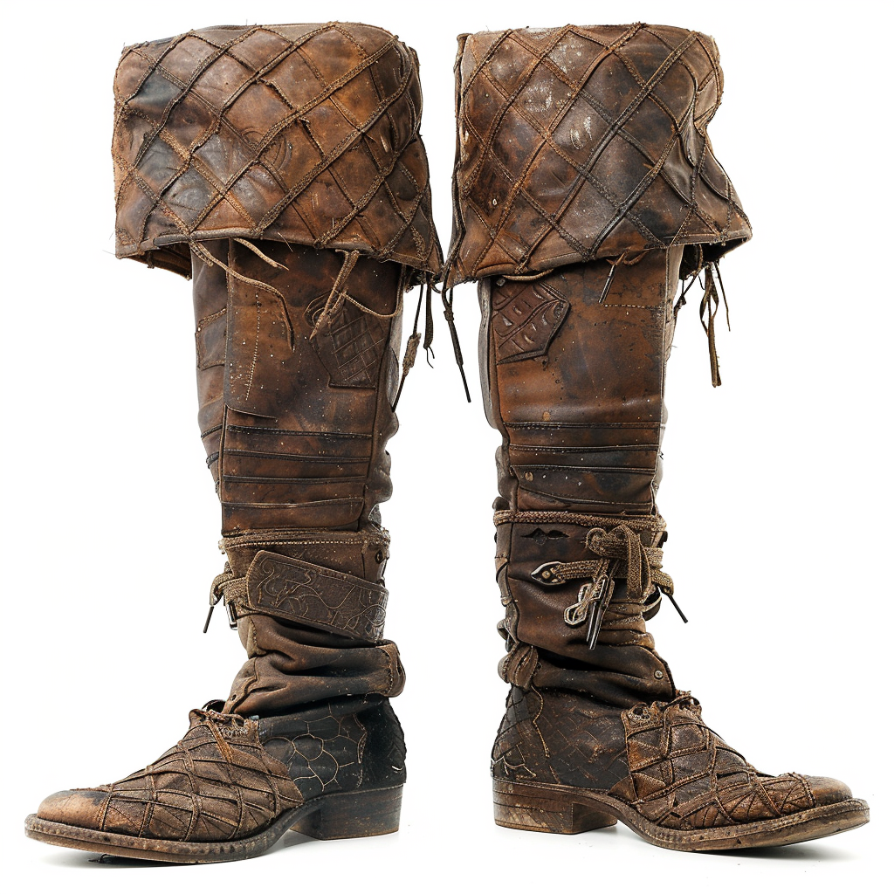

# Boots of False Tracks

- :octicons-info-24:{ .lg .middle } __Magic Boots__  
   Owned by [Viepuck](<../../../people/pcs/cleenseau/viepuck.md>)  
    :simple-dungeonsanddragons:{ .middle} [Mechanics](https://www.dndbeyond.com/magic-items/27025-boots-of-false-tracks) 

{align="right"; width="400"}A well-made set of heavy boots of unknown origin, found in [Wakog's Camp](<../../../gazetteer/greater-sembara/duchy-of-maseau/wakog-s-camp.md>).