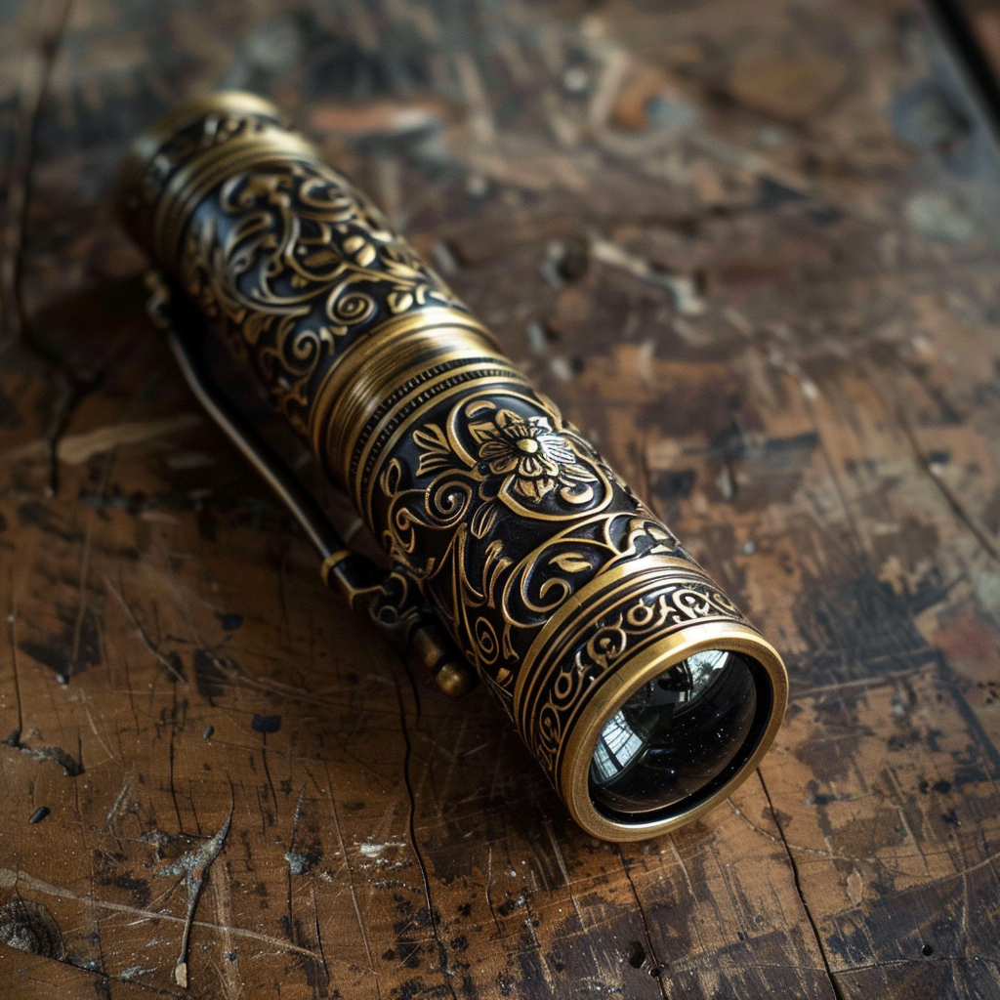

# Brot's Spyglass

- :octicons-info-24:{ .lg .middle } __Unique Mundane Telescope__  
   Created October 1st, 1719 (3 months ago)  
   Created by [Brot Starsearcher](<../../../people/dwarves/brot-starsearcher.md>), in [Taviose](<../../../gazetteer/greater-sembara/sembara/barony-of-aveil/cleenseau-region/taviose.md>), the [Manor of Cleenseau](<../../../gazetteer/greater-sembara/sembara/barony-of-aveil/cleenseau-region/manor-of-cleenseau.md>)  
   Owned by [Izgil Moonseeker](<../../../people/pcs/cleenseau/izgil-moonseeker.md>)  
    :simple-dungeonsanddragons:{ .middle} [Mechanics](https://www.dndbeyond.com/equipment/spyglass) 

{align="right"; width="420"}A clever spyglass that [Brot Starsearcher](<../../../people/dwarves/brot-starsearcher.md>) gave to [Izgil](<../../../people/pcs/cleenseau/izgil-moonseeker.md>) after he promised to seek funding for Brot's large telescope project. - An extremely cleverly made [copper telescope](<./brot-s-telescope-small.md>), given to Izgil by [Brot](<../../../people/dwarves/brot-starsearcher.md>).

Functions as a spyglass with better than usual field of vision.
