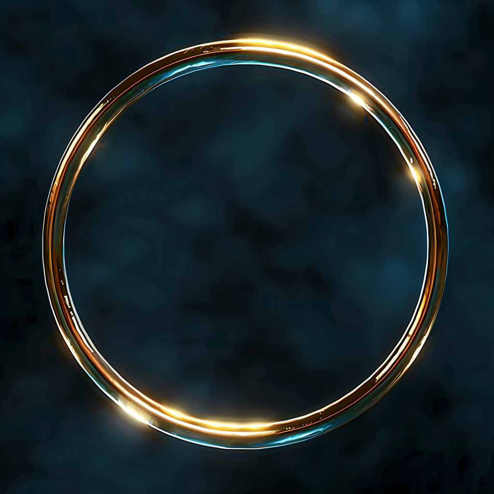

# Circlet of Telepathy

- :octicons-info-24:{ .lg .middle } __Magic Circlet__  
   Owned by [Viepuck](<../../../people/pcs/cleenseau/viepuck.md>)  
    :simple-dungeonsanddragons:{ .middle} [Mechanics](https://www.dndbeyond.com/magic-items/7834345-circlet-of-telepathy) 

{align="right"; width="420"}A golden circlet, found split across two pieces of enchanted armor, mysteriously rejoined. Found in the abandoned hobgoblin fort beneath Cleenseau.