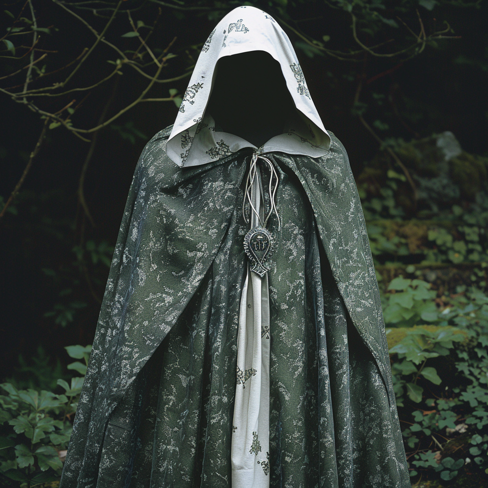

# Cloak of Concealment

- :octicons-info-24:{ .lg .middle } __Magic Cloak__  
   Owned by [Celyn](<../../../people/pcs/cleenseau/celyn.md>)  
    :simple-dungeonsanddragons:{ .middle} [Mechanics](https://www.dndbeyond.com/magic-items/4606-cloak-of-elvenkind) 

{align="right"; width="320"}A finely made green and white cloak found in a Ranger’s chest in the ruined hobgoblin fort under [Cleenseau](<../../../gazetteer/greater-sembara/sembara/barony-of-aveil/cleenseau-region/cleenseau/cleenseau.md>). Likely dates from the early 1600s.