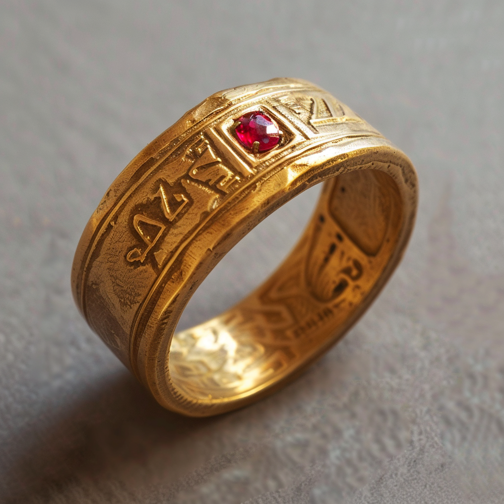

# Ring of Sorcerous Restoration

- :octicons-info-24:{ .lg .middle } __[Dwarven](<../../../species/children-of-the-embodied-gods/dwarves/dwarves.md>) Magical Ring__  
   Owned by [Izgil Moonseeker](<../../../people/pcs/cleenseau/izgil-moonseeker.md>)  
    :simple-dungeonsanddragons:{ .middle} [Mechanics](https://www.dndbeyond.com/magic-items/4691-pearl-of-power) 

{align="right"; width="420"}A thick golden ring, set with a small ruby and carved with the dwarven ruins for ‘knowledge’, ‘magic’, and ‘rebirth’. Found in the ruined hobgoblin fort beneath Cleenseau.