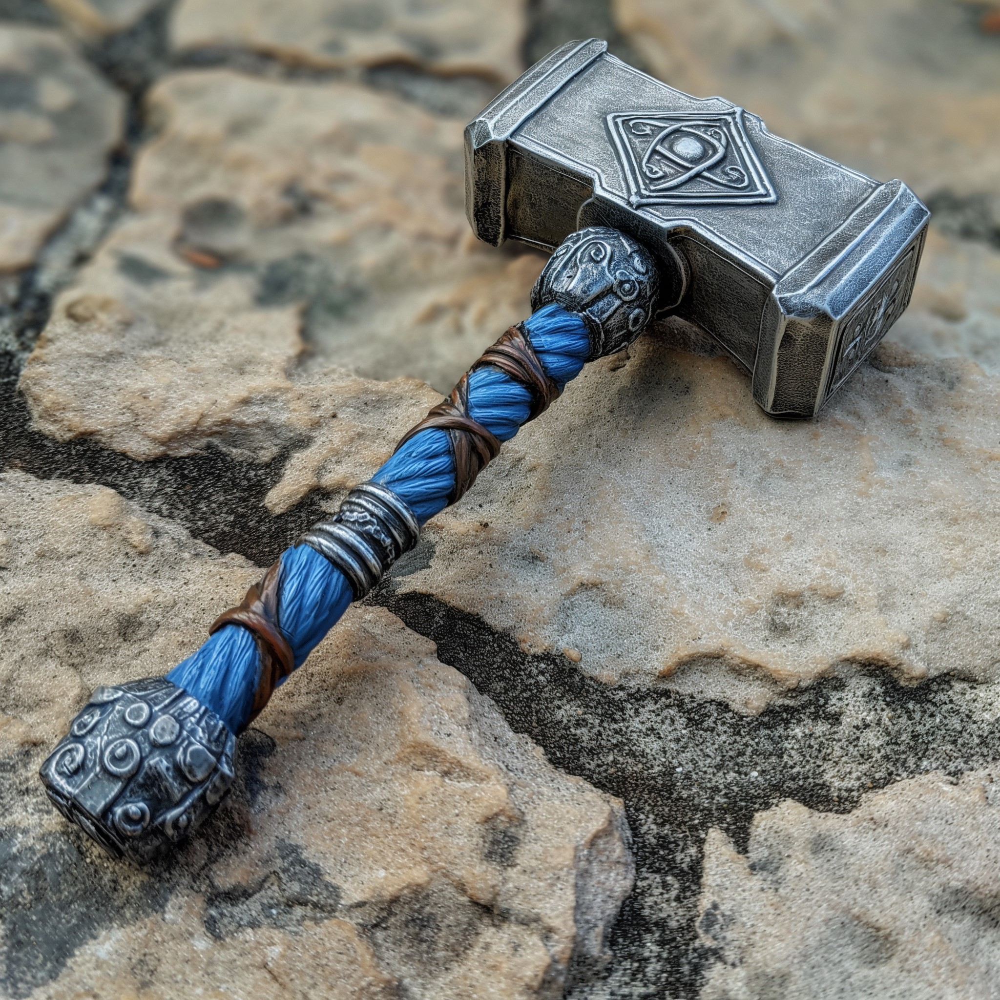

# The Hammer of Vigilance

- :octicons-info-24:{ .lg .middle } __Uncommon [Sembaran](<../../../gazetteer/greater-sembara/sembara/sembara.md>) Magical Warhammer__  
   Owned by [Robin of Abenfyrd](<../../../people/pcs/cleenseau/robin-of-abenfyrd.md>)  
    :simple-dungeonsanddragons:{ .middle} [Mechanics](https://www.dndbeyond.com/magic-items/7813717-hammer-of-vigilance) 

{align="right"; width="320"}A finely crafted silver and steel with blue wrappings. It seems to anticipate danger. It was found in a secret room in the underground hobgoblin fort beneath [Cleenseau](<../../../gazetteer/greater-sembara/sembara/barony-of-aveil/cleenseau-region/cleenseau/cleenseau.md>) and appears to be war loot from an unknown Sembaran hero, from several hundred years ago.