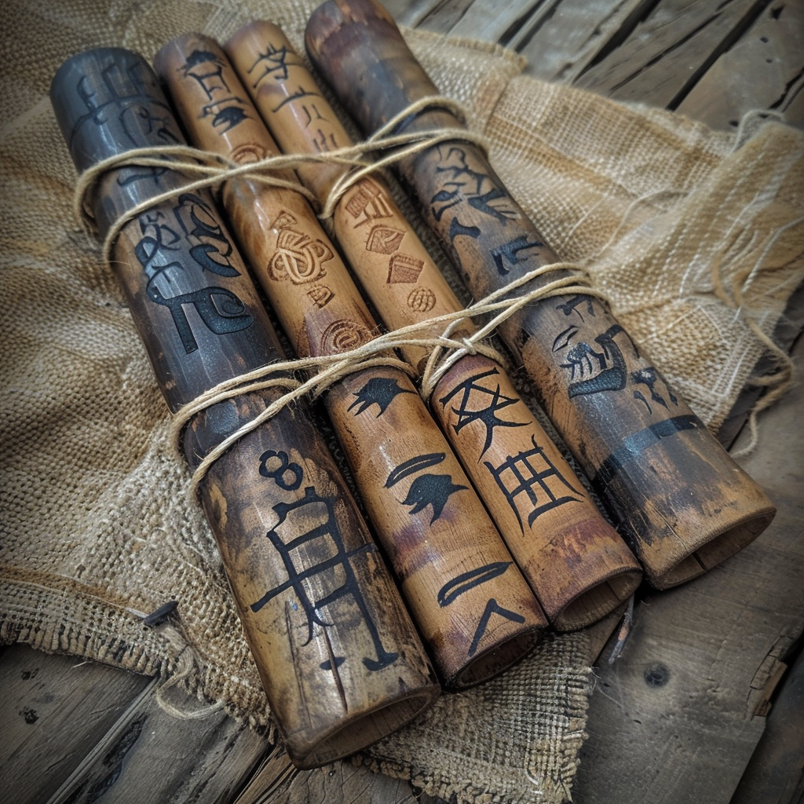

# Pipes of Insect Control

- :octicons-info-24:{ .lg .middle } __[Fey](<../../../species/children-of-the-divine/fey/fey.md>) Magic Pipes__  
   Owned by [Viepuck](<../../../people/pcs/cleenseau/viepuck.md>)  
    :simple-dungeonsanddragons:{ .middle} [Mechanics](https://www.dndbeyond.com/magic-items/6684130-pipes-of-beast-control) 

{align="right"; width="420"}A set of pan pipes, crudely made and lashed together with twine. Each of the four pipes plays a different note.  Originally of suspected fey make, and found in the [Cleenseau Wood](<../../../gazetteer/greater-sembara/sembara/barony-of-aveil/cleenseau-region/cleenseau-wood.md>) by some bandits. Later found in the bandit lair by the [Heroes of Cleenseau](<../../../people/pcs/cleenseau/heroes-of-cleenseau.md>).