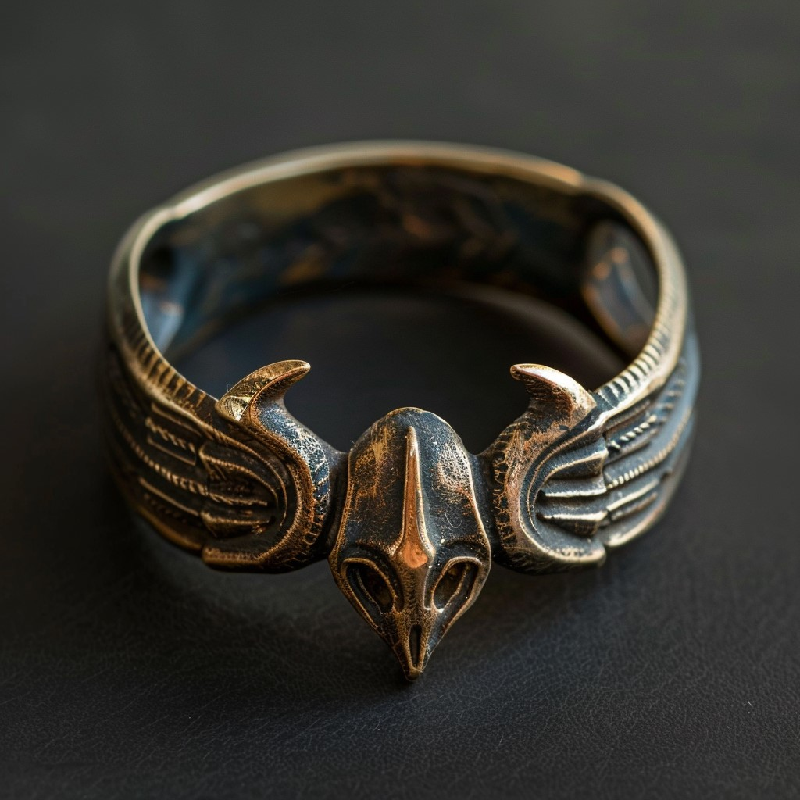

# Ring of Escape

- :octicons-info-24:{ .lg .middle } __Magic Ring__  
    :simple-dungeonsanddragons:{ .middle} [Mechanics](https://www.dndbeyond.com/magic-items/8697391-ring-of-escape) 

{align="right"; width="420"}A dusky ring, taken from [Gareth of Tollen](<../../../people/sembarans/gareth-of-tollen.md>) after his capture. 

