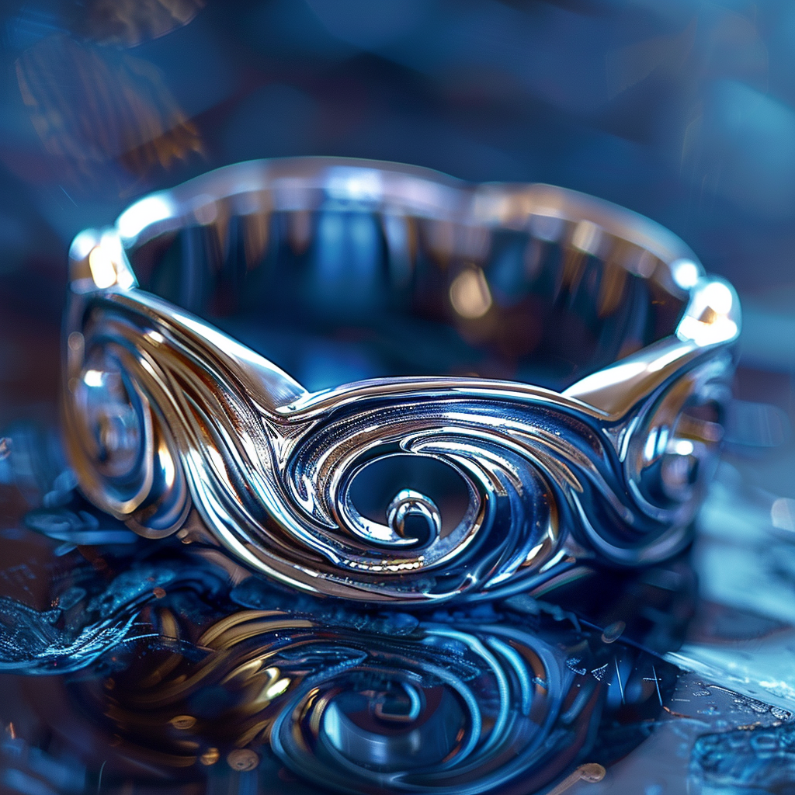

# Ring of Jumping

- :octicons-info-24:{ .lg .middle } __Uncommon Magical Ring__  
   Owned by [Robin of Abenfyrd](<../../../people/pcs/cleenseau/robin-of-abenfyrd.md>)  
    :simple-dungeonsanddragons:{ .middle} [Mechanics](https://www.dndbeyond.com/magic-items/4724-ring-of-jumping) 

{align="right"; width="320"}A delicate silver ring, with many engraved swirling lines, which, in the right light, appear slightly blue, of unknown origin, found in [Wakog's Camp](<../../../gazetteer/greater-sembara/duchy-of-maseau/wakog-s-camp.md>).