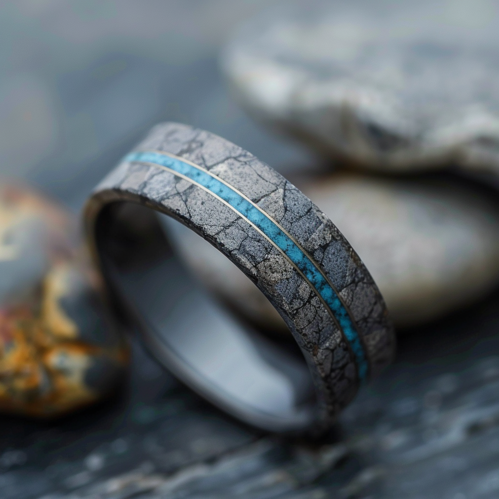

# Ring of Water Walking

- :octicons-info-24:{ .lg .middle } __Magical Ring__  
    :simple-dungeonsanddragons:{ .middle} [Mechanics](https://www.dndbeyond.com/magic-items/4737-ring-of-water-walking) 

{align="right"; width="420"}A smooth granite ring with a faint line of blue, from the Ranger chest in the ruined hobgoblin fort beneath Cleenseau. Of unknown origin.
