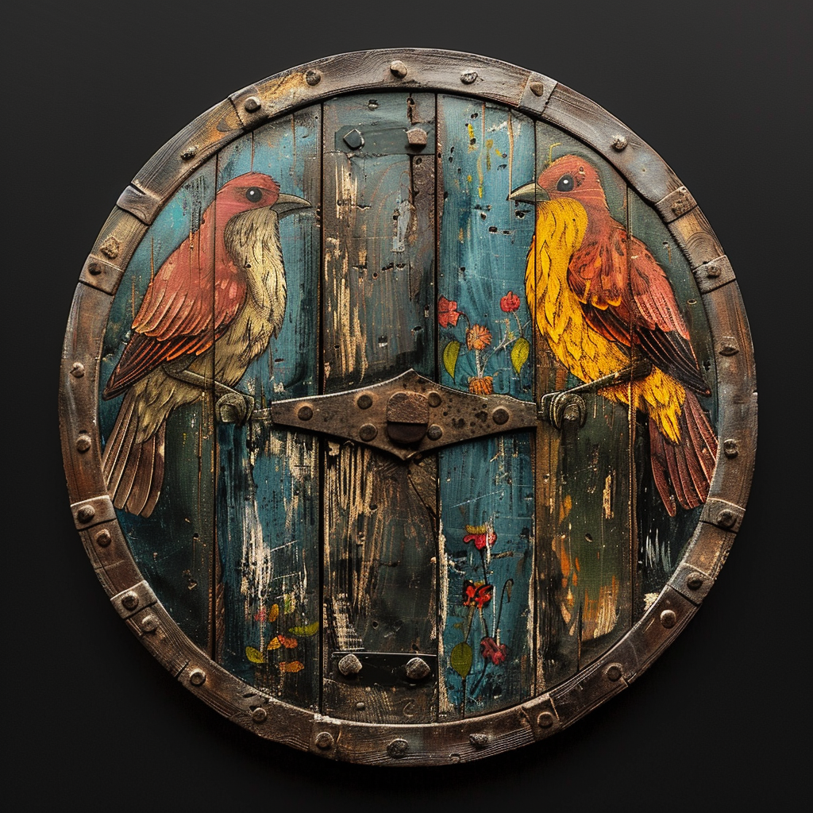

# The Shield of False Life

- :octicons-info-24:{ .lg .middle } __[Drankorian](<../../../history/drankorian-era/drankorian-empire.md>) Magic Shield__  
   Owned by [Celyn](<../../../people/pcs/cleenseau/celyn.md>)  
    :simple-dungeonsanddragons:{ .middle} [Mechanics](https://www.dndbeyond.com/magic-items/7487214-shield-of-life-giving) 

{align="right"; width="320"}A slightly battered Drankorian shield with an ever shifting set of sigils on its face, found in [Wakog's Camp](<../../../gazetteer/greater-sembara/duchy-of-maseau/wakog-s-camp.md>). 