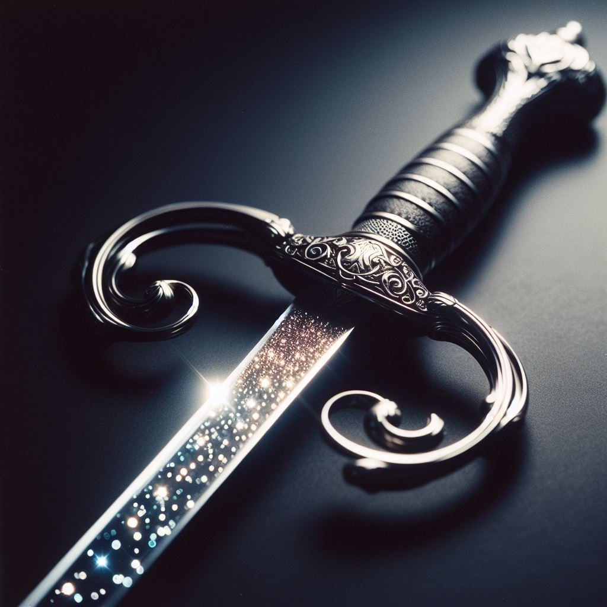

# Silverthorn

- :octicons-info-24:{ .lg .middle } __Unique [Halfling](<../../../species/children-of-the-embodied-gods/halflings/halflings.md>) Magic Rapier__  
   Owned by [Celyn](<../../../people/pcs/cleenseau/celyn.md>)  
    :simple-dungeonsanddragons:{ .middle} [Mechanics](https://www.dndbeyond.com/magic-items/7793313-rapier-of-surprise) 

{align="right"; width="300"}A slim rapier, gleaming but always a bit hard to see. Found on a dead halfling beneath [Cleenseau](<../../../gazetteer/greater-sembara/sembara/barony-of-aveil/cleenseau-region/cleenseau/cleenseau.md>). This was originally the possession of Rose Stonebridge, a halfling who lived in Cleenseau in the 1400s. 

According to [Marigold Stonebridge](<../../../people/halflings/marigold-stonebridge.md>), Rose was one of the leaders of a resistance to hobgoblin occupation during the Dominion of Avatus. The matching sheath was given to [Celyn](<../../../people/pcs/cleenseau/celyn.md>) by Marigold, and while not exactly magical, it appears to be exceptional at concealment, and with barely any effort the rapier can vanish into one's cloak.