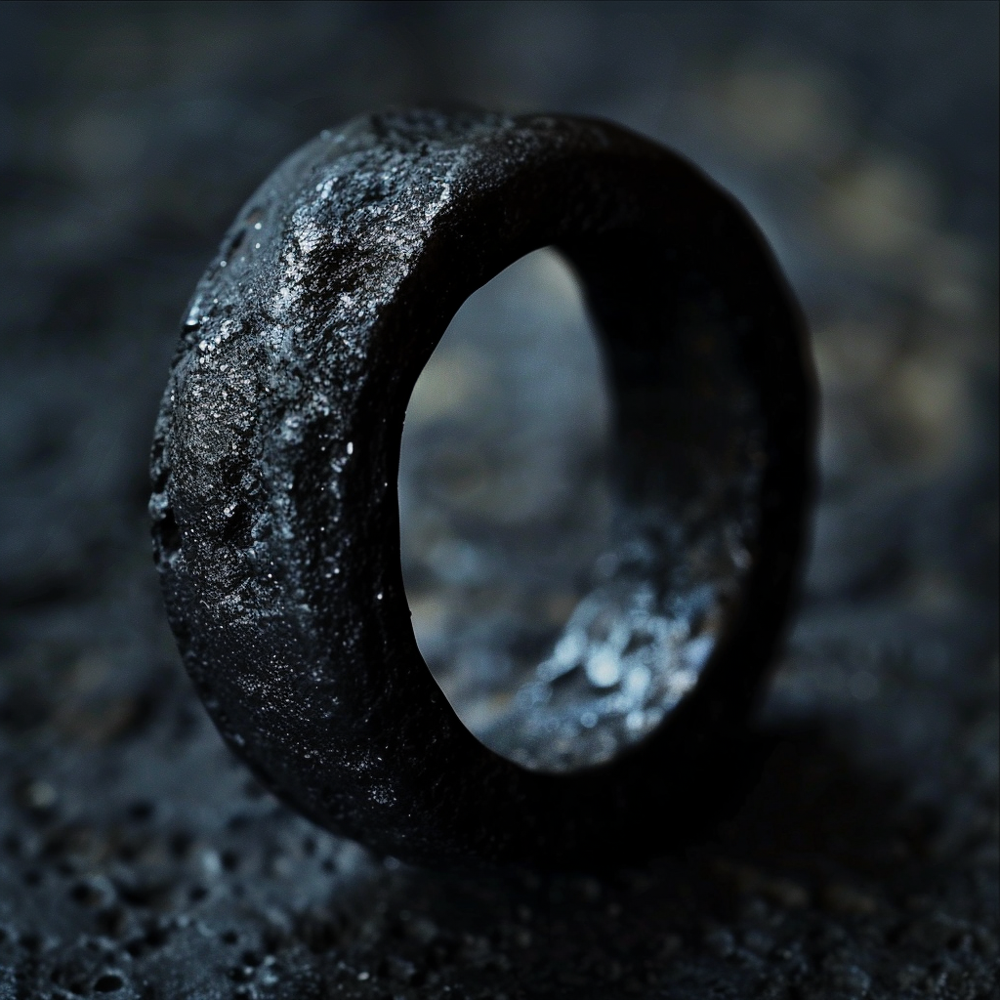
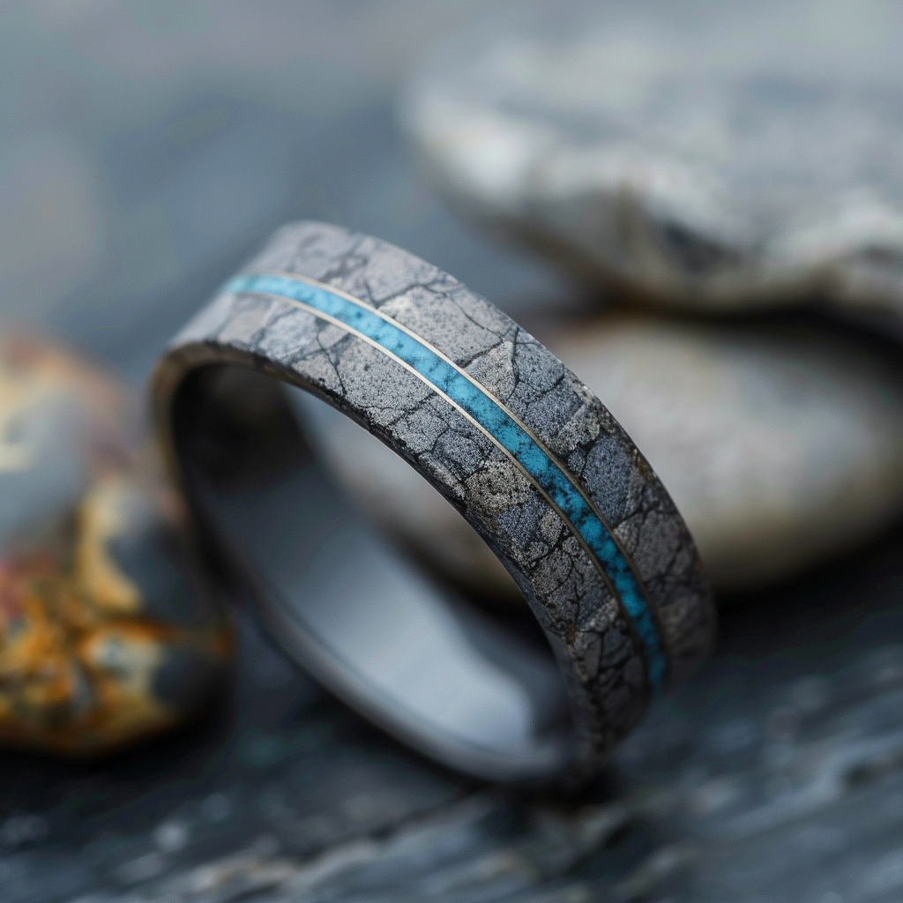
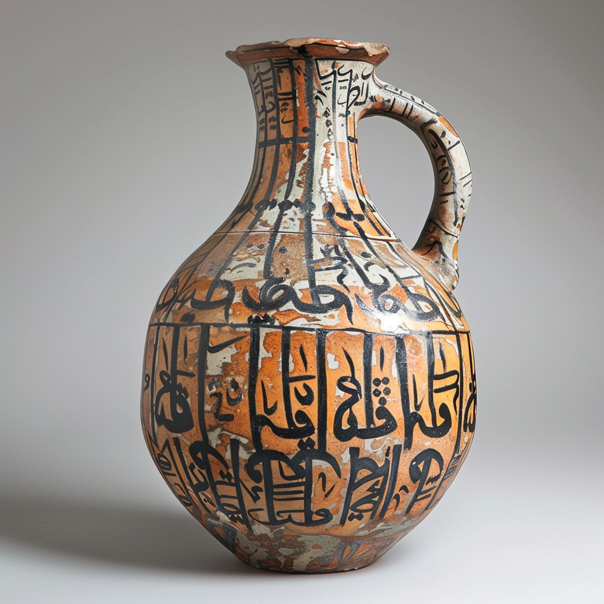
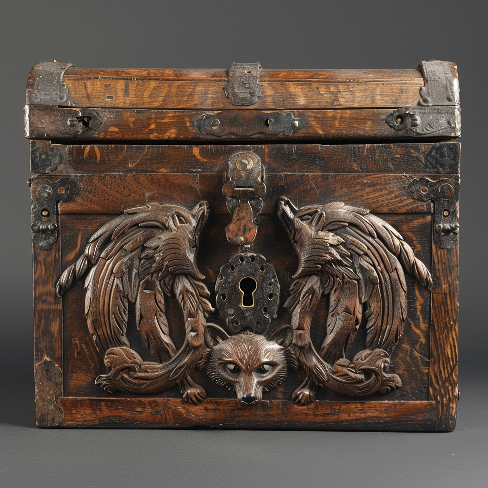

# Party Treasure

Total available gold: 590 - 885
## Magical and Unusual Items

| Image                                           | Name                                                                                                    | Type  | Mechanics                                                                               |
| ----------------------------------------------- | ------------------------------------------------------------------------------------------------------- | ----- | --------------------------------------------------------------------------------------- |
| {width="240"}           | [Ring of Wounding](<./ring-of-wounding.md>)                         | ring  | [Reference](https://www.dndbeyond.com/magic-items/8244293-ring-of-wounding)             |
| {width="240"} | [Ring of Water Walking](<./ring-of-waterwalking-cleenseau.md>)    | ring  | [Reference](https://www.dndbeyond.com/magic-items/4737-ring-of-water-walking)           |
| {width="240"}             | [Ewer of Liquid](<./ewer-of-liquid-cleenseau.md>)                 | ewer  | [Reference](https://www.dndbeyond.com/magic-items/6683137-ewer-of-liquid)               |
| {width="240"}   | [Chest of the Forest Guardian](<./chest-of-the-forest-guardian.md>) | chest | [Reference](https://www.dndbeyond.com/magic-items/8244307-chest-of-the-forest-guardian) |

## Jewelry
* Three golden chains, that jewelry could be strung on, relatively thick and heavy, 16" - 18" long (value: 25 - 30 gp each)
* Two wide but simple gold rings, stolen from [Lorin Valbert](<../../../people/sembarans/lorin-valbert.md>) (value: 20 - 25 gp each)
## Gemstones
- two small uncut pieces of amber (value: 20 - 25 gp, could double with proper cutting)
- a large but tarnished pearl (value: 60 - 80 gp)
- a exquisitely cut piece of turquoise with a silver setting (probably once part of a ring) (value: 30 - 40 gp, could triple if made into a finished ring)
## Miscellany
- A well-worked and elaborate saddle with gold and silver paneling and small amethysts (value: 120 - 200 gp)
- A well made jewerly box with an elaborate lock (value: 5 - 10 gp)
## Coin
- 1000 silver Dwarven coins (worth 100 gp, common trade coin), found in the ruined fort on the south bank of the Enst
- 100 unfamiliar gold coins with a stylized river on both sides (work 75 gp by weight of gold, could be worth more to the right buyer), found in the ruined fort on the south bank of the Enst
- 300 unfamiliar and differently sized silver coins with a bloody claw on the back and a variety of numbers (1, 5, 10) stamped on the front, which seem to correlate with the size (worth 45 gp by weight, could be worth more to the right buyer), found in the ruined fort on the south bank of the Enst
## Given Away or Sold

- 50 heavy gold coins, from the reign of Derrick III, found in the bandit lair (given to Rosalind)    
- Two finely cut rubies, each the size of a pinky nail, worth 500 gp each, found in the bandit lair (given to Rosalind)
- A well crafted suit of plate armor, still serviceable, apparently Sembaran, from the hobgoblin lair. Given to the Cleenseau army garrison in exchange for help making barding.
- A well made shield, apparently Sembaran. Given to the Cleenseau army garrison in exchange for help making barding.
- A beautiful but tiny opal (value: 50 - 70 gp), donated to [Ida Rosfeld](<../../../people/sembarans/ida-rosfeld.md>) and the war effort
- An elaborate silver ring set with small diamonds (value: 250 - 400 gp), donated to [Ida Rosfeld](<../../../people/sembarans/ida-rosfeld.md>) and the war effort