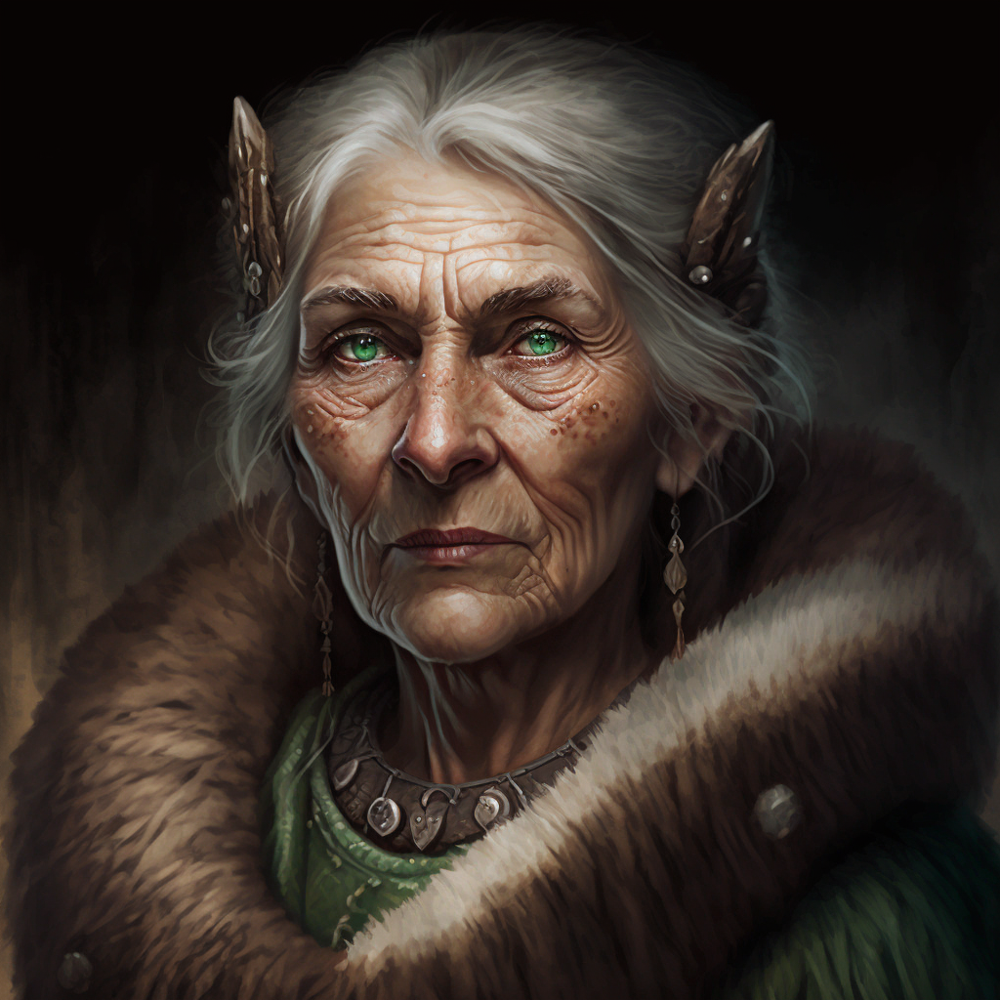

# Safri

- :octicons-info-24:{ .lg .middle } __Biographical Information__

    A Deno'qai [human](<../../species/children-of-divine-creation/humans/humans.md>) (she/her)  
    { .bio }

    Originally from: Unknown

{align="right"; width="320"}An old Deno'qai druid with many stories and rumors to her name. Many claim to have met her, but most speak of her in animal form, a deer that acts unusually intelligent and leads a lost traveler back to a path, or a hawk that drops a brace of rabbits on the camp of a hungry family who have had bad luck with the hunt.

