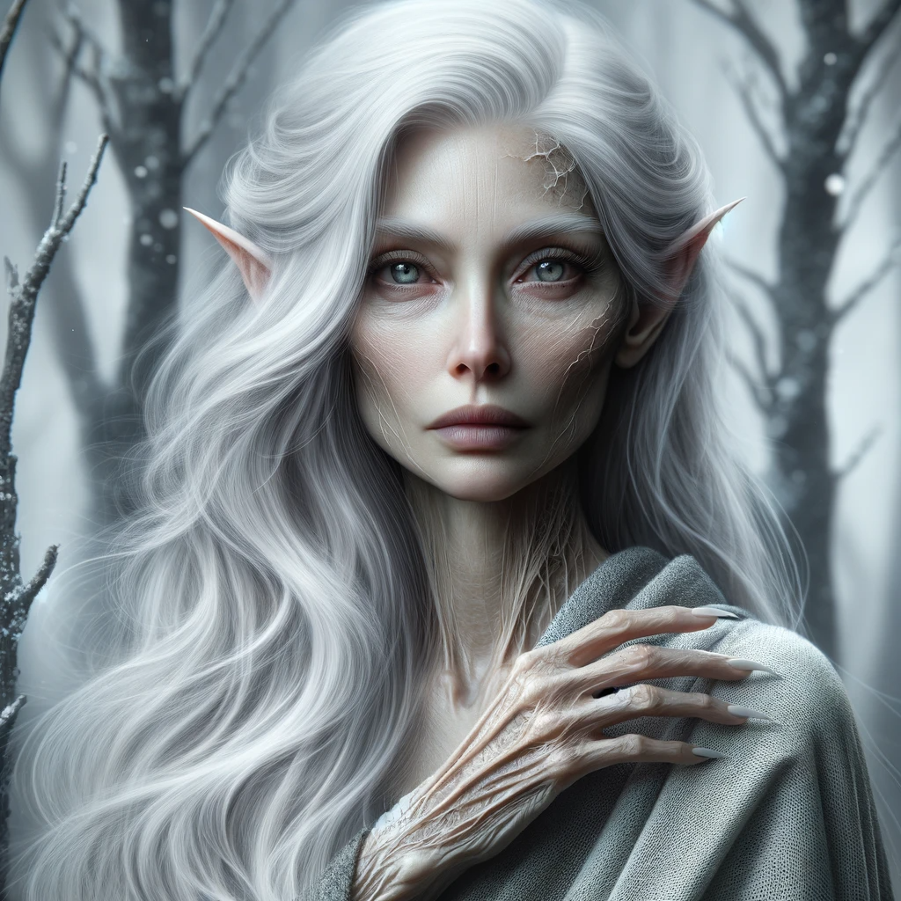

# Arheste
:speaker:{ .middle } *(AR-hes-teh)*  

- :octicons-info-24:{ .lg .middle } __Biographical Information__

    { .bio }

Arheste is an ancient [elf](<../../species/children-of-the-embodied-gods/elves/elves.md>), with silver hair and piercing eyes, originally born during the days of the Drankorian Empire. He right arm is withered, cramped, and useless, usually worn in a sling, and she looks worn in a way that is very unusual for elves. She spent much of the first several hundred years of her life in Drankor first as an ally of the emperors, and then, during Apollyon's reign, as a prisoner. After the [First Plague](<../../events/1000s/1059/first-plague.md>), which she survived, albeit damaged and sick, she fled north and eventually settled in [Orenlas](<../../gazetteer/istaros-watershed/orenlas/orenlas.md>). 

*Arheste in an earlier time, before the [First Plague](<../../events/1000s/1059/first-plague.md>).*

*Arheste in [Orenlas](<../../gazetteer/istaros-watershed/orenlas/orenlas.md>).*

