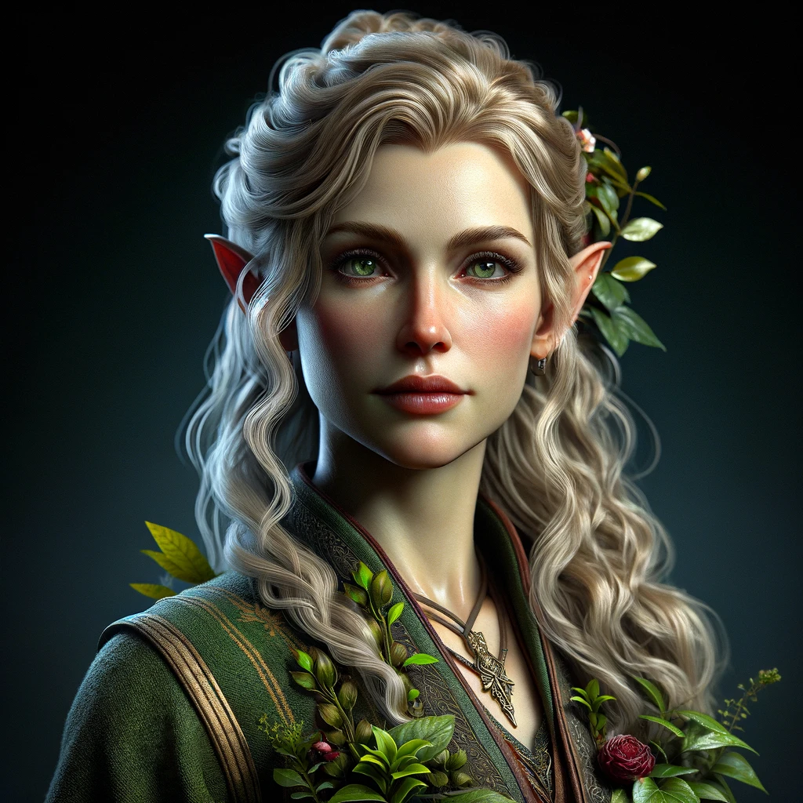

# Ealwen
*(EY-ahl-wen)*
>[!info]+ Biographical Info  
> An [elf](<../../species/children-of-the-embodied-gods/elves/elves.md>) (she/her), ([ka](<../../species/children-of-the-embodied-gods/elves/the-cycle-of-generations.md>) 37)  
>   
>>   
>> 

A gardener, herbalist, and caretaker of [Arheste](<./arheste.md>). 

