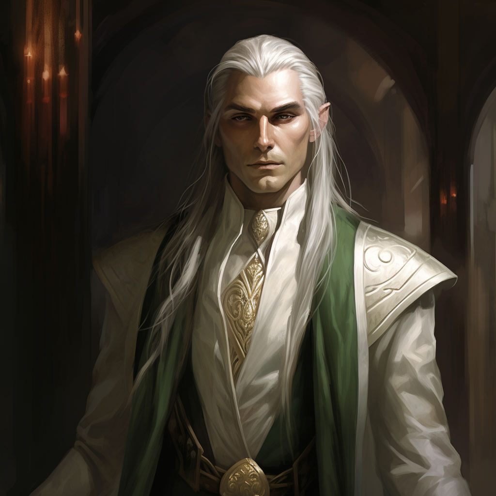

# Melindir
*(meh-LIN-deer)*
>[!info]+ Biographical Info
> an [elf](<../../species/children-of-the-embodied-gods/elves/elves.md>) (he/him), of ([ka](<../../species/children-of-the-embodied-gods/elves/the-cycle-of-generations.md>) 35)
>> 
>> 

Melindr is the Ambassador to [Tollen](<../../gazetteer/western-green-sea/tollen/tollen.md>) for the elven lands of [Orenlas](<../../gazetteer/istaros-watershed/orenlas/orenlas.md>).

