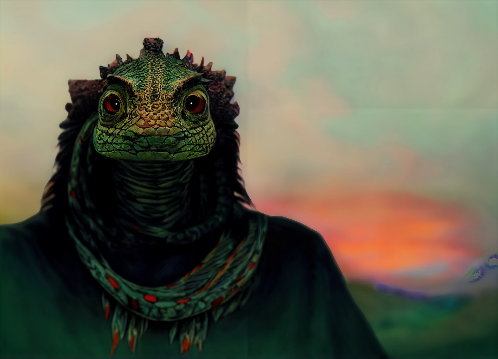

# Elazar

- :octicons-info-24:{ .lg .middle } __Biographical Information__

    A [lizardfolk](<../../species/children-of-the-embodied-gods/lizardfolk/lizardfolk.md>) (he/him)  
    Born DR 1665 (55 years old)  
    { .bio }

    Based in [Bedez](<../../gazetteer/far-south/bedez.md>), [Orekatu](<../../gazetteer/far-south/orekatu.md>), the South Region

A lizardfolk man in the prime of his life, a prophet, seer, and spirit guide who has deeply felt visions and exceptional perception into the spirit realms. A bit of an outcast in his village, seen as someone who sees trouble in everything.

{width="500"}

