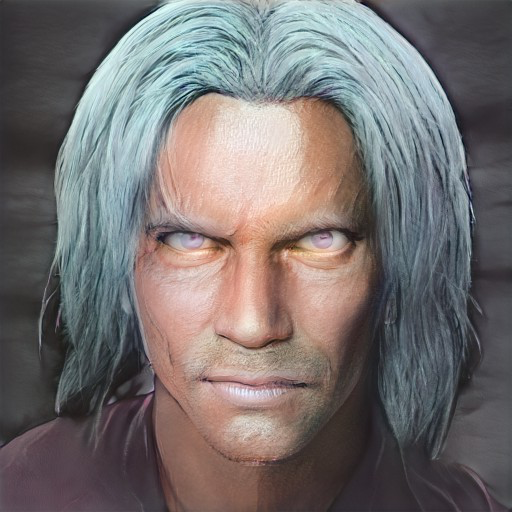

# Tharandros
:speaker:{ .middle } *(tha-RAN-dros)*  

- :octicons-info-24:{ .lg .middle } __Biographical Information__

    A [centaur](<../../species/children-of-the-divine/centaurs/centaurs.md>) (he/him)  
    { .bio }

    Originally from: Unknown

{align="right"; width="500"}A centaur, the leader of a wandering herd. Wise and knowledgable.

