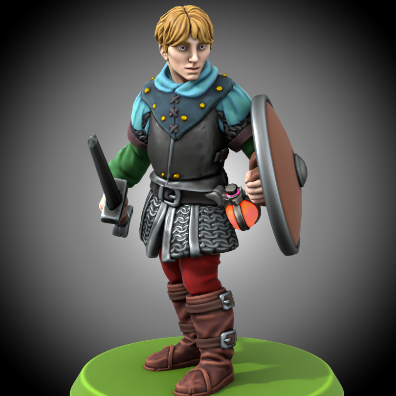
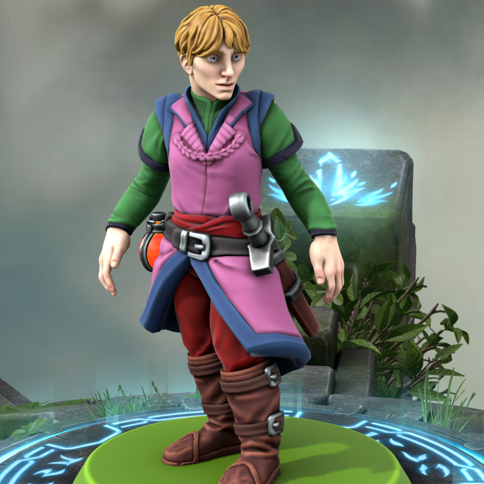

# Robin of Abenfyrd

- :octicons-info-24:{ .lg .middle } __Biographical Information__

    A [Tyrwinghan](<../../../gazetteer/greater-sembara/tyrwingha/tyrwingha.md>) [human](<../../../species/humans/humans.md>) (he/him)  
    Born DR 1700 (20 years old)  
    Member of the [Heroes of Cleenseau](<./heroes-of-cleenseau.md>)  
    { .bio }

    Originally from: [Abenfyrd](<../../../gazetteer/greater-sembara/tyrwingha/abenfyrd.md>), [Tyrwingha](<../../../gazetteer/greater-sembara/tyrwingha/tyrwingha.md>)

:octicons-location-24:{ .lg .middle } Currently in [Cleenseau](<../../../gazetteer/greater-sembara/sembara/barony-of-aveil/cleenseau-region/cleenseau/cleenseau.md>), the [Manor of Cleenseau](<../../../gazetteer/greater-sembara/sembara/barony-of-aveil/cleenseau-region/manor-of-cleenseau.md>), the [Barony of Aveil](<../../../gazetteer/greater-sembara/sembara/barony-of-aveil/barony-of-aveil.md>)

Robin of Abenfyrd is a young man of about twenty, a paladin of [The Wanderer](<../../../cosmology/gods/incorporeal-gods/mos-numena/the-wanderer.md>), and hails from [Tyrwingha](<../../../gazetteer/greater-sembara/tyrwingha/tyrwingha.md>). He has a friendly, if shy, demeanor and at times seems embarrassed by his own talents. His armor looks weathered and well used (he was probably not the first owner) but well maintained. His clothing looks a bit more appropriate to a bard than a traveling warrior, and while again not the fanciest, tends to be rather colorful and a bit flamboyant even. He keeps a [small lantern](<../../../campaigns/cleenseau-campaign/treasure/lantern-of-the-bright-hearth.md>) on him that sheds a perpetual warm glow that reminds one of home and pleasant things. His other most prized possession is a lute (not the fanciest instrument ever, but it is clearly well cared for) for that he plays with the skill of a well practiced musician. Often appearing a bit awkward when first interacting with others, he seems far more relaxed while he plays

{width="320"}
{width="320"}

> [!INFO]- Robin's Background (For Dan's Eyes Only)
> Robin grew up in a small village, [Abenfyrd](<../../../gazetteer/greater-sembara/tyrwingha/abenfyrd.md>), a wooded backwater along the [Aben](<../../../gazetteer/greater-sembara/rivers/aben-watershed/aben.md>) in the Tyrwinghan marches. Not much happens in [Abenfyrd](<../../../gazetteer/greater-sembara/tyrwingha/abenfyrd.md>) save the yearly [Festival of the Miracle of the Mist](<../../../time/holidays-and-festivals/festival-of-the-miracle-of-the-mist.md>), each spring, a commemoration of a time when [The Wanderer](<../../../cosmology/gods/incorporeal-gods/mos-numena/the-wanderer.md>) (it is said) used dense mists to lead a pack of trolls from the Plaguelands into the river, to drown. Robin always felt like he had a special connection to [The Wanderer](<../../../cosmology/gods/incorporeal-gods/mos-numena/the-wanderer.md>), and would often have vivid dreams of himself performing quiet, helpful miracles in the days around this festival.  
> 
> He was born in the fall of 49 Cece I (1701, in the Drankorian reckoning) into a family of carpenters. His parents made a living mending and making furniture, barrels, and wooden tools. He grew up comfortable enough and was often around woodworking, learning to be nimble and dexterous at an early age. Robin grew up a quiet kid, somewhat out of place in his village. When he was a kid, he had a tendency to leave out wreaths and other tokens in secret especially for those who seemed sad or lonely. During the springtime [Festival of the Miracle of the Mist](<../../../time/holidays-and-festivals/festival-of-the-miracle-of-the-mist.md>) he would leave wreaths of new spring blooms on the doorsteps of those who had suffered setbacks in the last year, and during the winter months he would try to find bittersweet and other winter berries to give.  One year, when Robin was six or seven, an old woman in the village with many daughters fell in the woods badly when she was out gathering her favorite spring flowers. She never recovered after the fall, and died of internal bleeding a few days later. Everyone in her household was obviously very sad, but Robin saw her hanging around the back -- a ghost. He left a wreath of her favorite flowers, each morning for two days, and each morning the ghost would point at the flowers and make weird hand motions. He didn't really know what to do, but being shy, never told anyone. The third morning -- a very calm, still day, with absolutely no breeze, and the day before the festival -- one of the flowers drifted off the wreath and floated as if on the breeze. The ghostly woman jumped up and down, seemingly agitated, and pointed at the flower. Robin got the idea that he should follow the flower, and did so. It took him out in the woods to the old woman's favorite flower patch, where, hidden under some fall leaves, was an engraved ring on a silver chain -- a family heirloom. Robin brought it back to the house, wove it into the wreath, and left the wreath back on the doorstep. As he glanced back, he saw the old woman fading away with a look of gratitude and peace on her face.  
> 
> He never really told anyone about this, but it was a formative experience of [The Wanderer](<../../../cosmology/gods/incorporeal-gods/mos-numena/the-wanderer.md>).  
> 
> Life continued in [Abenfyrd](<../../../gazetteer/greater-sembara/tyrwingha/abenfyrd.md>), where little happened, the seasons passed, the festivals were celebrated, and Robin stayed on the sidelines. In his seventeenth year (1718), however, the spring came late, and the cold lingered. 
> 
> One evening, after the moonset, in the quietest part of the night, Robin awakened suddenly. He had a tingle on the back of his neck and just knew, via some divine sense from the Wanderer, that something was wrong. He went outside and saw a dark shape -- a warg -- stalking a man. He shouted a warning and ran forward, and the man drew a sword and killed the warg. And thus he was introduced to Gareth Wolfsbane, a member of the Rangers based out of the Aben garrison of the Army of Mostreve. The man was very greatful, and they talked for some time the next morning. At his encouragement, Robin went to the garrison and spent some time training. He learned to fight with a rapier there, as benefited his natural dexterity. But he never felt satsified with the life of a solider, and never actually joined the army.
> 
> Nevertheless, he did go on several patrols, and spent the better part of a year there. His sense of the Wanderer grew stronger as well.
> 
> One morning -- May 31, 1719, to be exact -- he left with Gareth and four others for a two day patrol through the Mostreve Hills. Rumors of a troll had come to the garrison, and Gareth was anxious to find it before it wandered into more civilized lands. They party of six set out and that evening they camped under the full moon in under a small overhang by a large hill. A trickling brook rushed past and the wooded hill was pleasant in the spring air. Robin awoke at moonrise, feely oddly awake. He saw, glinting further up the hill, an eerie white light. It called to him, and he followed the sparkle of the light up the hill. He came 

