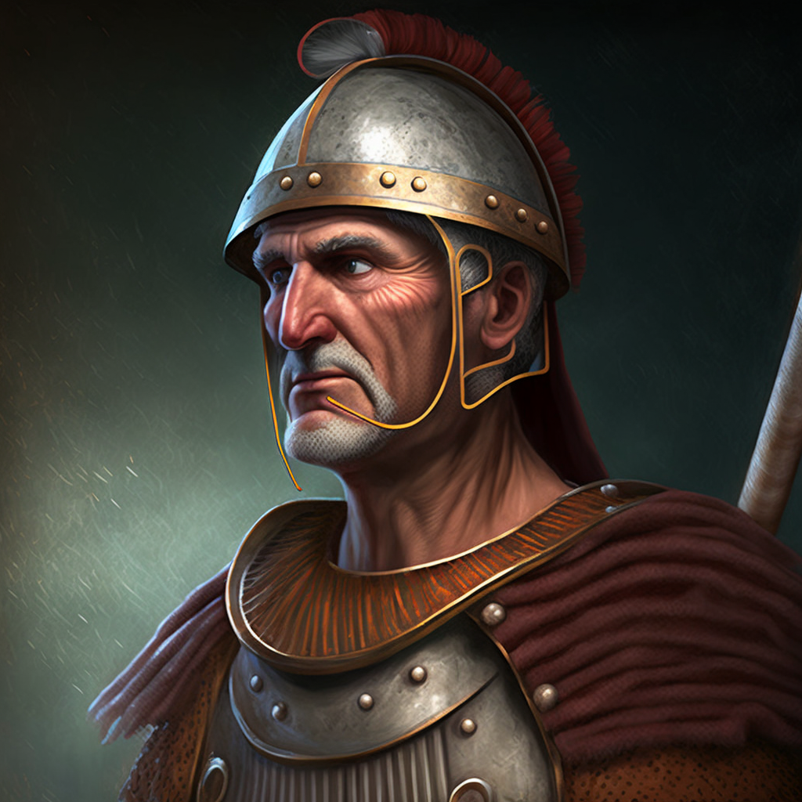

# Caulaus

- :octicons-info-24:{ .lg .middle } __Biographical Information__

    A [Drankorian](<../../../../history/drankorian-era/drankorian-empire.md>) [human](<../../../../species/humans/humans.md>) (he/him)  
    { .bio }

{align="right"; width="320"}A human warrior from [Drankor](<../../../../history/drankorian-era/drankor.md>), trapped in the Cosmology/Multiverse/Echo Realms/Feywild/Feywild for nearly 1000 years. Not fully in possession of his wits or memories. A guide and wanderer in Amberglow; sought by [Seeker](<../seeker.md>) as a guide to the fey crossing at [Lastlight Falls](<../../../../cosmology/multiverse/echo-realms/feywild/lastlight-falls.md>). 

Stayed to guard [Agata](<../../../fey/agata.md>)'s prison in Session 67 (DuFr).