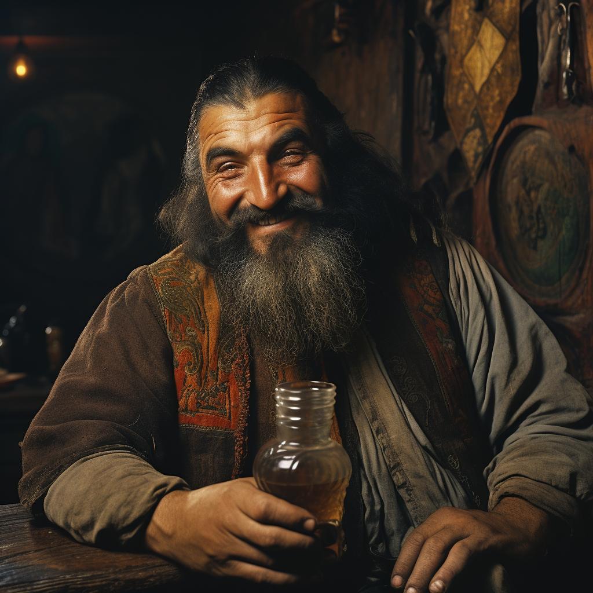

# Duncan Rivers

- :octicons-info-24:{ .lg .middle } __Biographical Information__

    A [Sembaran](<../../gazetteer/greater-sembara/sembara/sembara.md>) [human](<../../species/humans/humans.md>) (he/him)  
    Born DR 1672 (48 years old)  
    Proprietor of [The Bandit’s End](<../../gazetteer/greater-sembara/sembara/barony-of-aveil/cleenseau-region/cleenseau/the-bandits-end.md>)  
    { .bio }

    Based in [The Bandit’s End](<../../gazetteer/greater-sembara/sembara/barony-of-aveil/cleenseau-region/cleenseau/the-bandits-end.md>), [Cleenseau](<../../gazetteer/greater-sembara/sembara/barony-of-aveil/cleenseau-region/cleenseau/cleenseau.md>), the [Manor of Cleenseau](<../../gazetteer/greater-sembara/sembara/barony-of-aveil/cleenseau-region/manor-of-cleenseau.md>)

:octicons-location-24:{ .lg .middle } Helped by the [Heroes of Cleenseau](<../pcs/cleenseau/heroes-of-cleenseau.md>) on January 4th, 1720 in [The Bandit’s End](<../../gazetteer/greater-sembara/sembara/barony-of-aveil/cleenseau-region/cleenseau/the-bandits-end.md>), [Cleenseau](<../../gazetteer/greater-sembara/sembara/barony-of-aveil/cleenseau-region/cleenseau/cleenseau.md>), the [Manor of Cleenseau](<../../gazetteer/greater-sembara/sembara/barony-of-aveil/cleenseau-region/manor-of-cleenseau.md>)  

{align="right"; width="320"}A jovial barkeep and innkeeper, he is very fond of his inn and a little full of himself. He does not like asking for help very much, and rarely admits he needs it. He is suspicious of magic and speaks often of the "good old days" of Cece's reign.