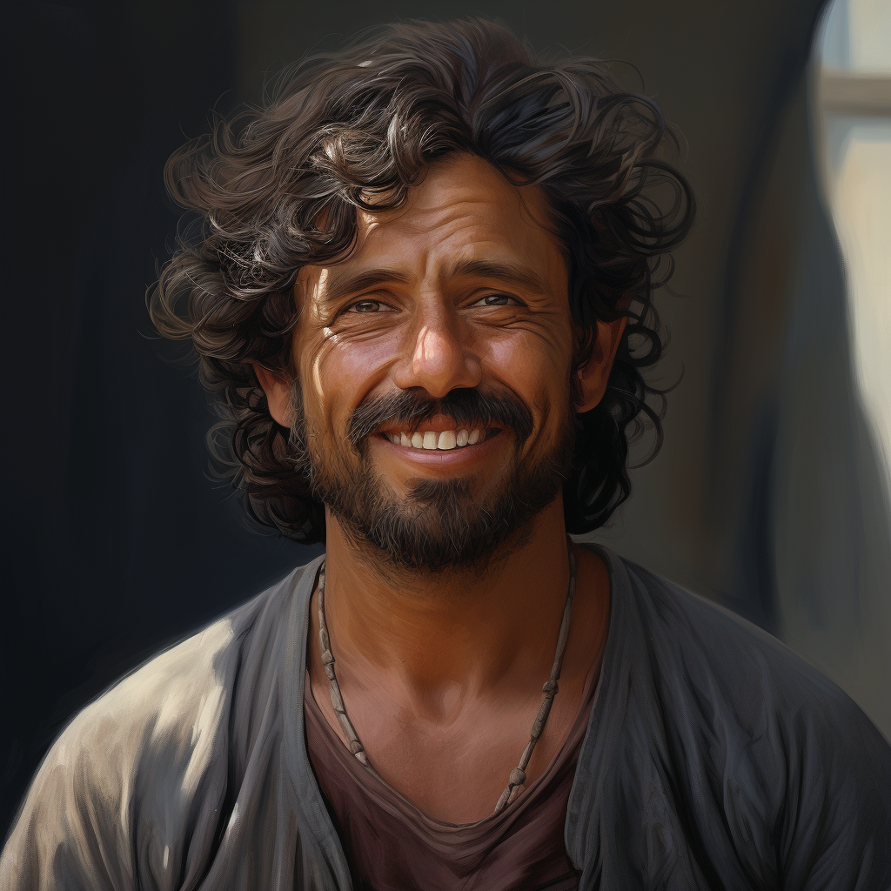

# Gideon Thorne

- :octicons-info-24:{ .lg .middle } __Biographical Information__

    A [Sembaran](<../../gazetteer/greater-sembara/sembara/sembara.md>) [human](<../../species/humans/humans.md>) (he/him)  
    Born DR 1672 (48 years old)  
    { .bio }

    Based in [Aulout](<../../gazetteer/greater-sembara/sembara/barony-of-aveil/cleenseau-region/aulout.md>), [Cleenseau](<../../gazetteer/greater-sembara/sembara/barony-of-aveil/cleenseau-region/cleenseau/cleenseau.md>), the [Manor of Cleenseau](<../../gazetteer/greater-sembara/sembara/barony-of-aveil/cleenseau-region/manor-of-cleenseau.md>)

{align="right"; width="320"}A fisherman and the most prominent person in the small hamlet of [Aulout](<../../gazetteer/greater-sembara/sembara/barony-of-aveil/cleenseau-region/aulout.md>). Much of his family lives in the North Close of Cleenseau, including his son [Gabriel Thorne](<./gabriel-thorne.md>) and his nephew [Jon Thorne](<./jon-thorne.md>). He lives with his two grown daughters and their families, both of whom are also fisherfolk. 

He knows the river well, and is an admirer of the lizardfolk of [Ganboa](<../../gazetteer/greater-sembara/sembara/barony-of-aveil/cleenseau-region/ganboa.md>). He went with [Rinault](<./rinault-essford.md>) on his ill-advised trip searching the river after the [Tragic Flood of the River Enst](<../../events/1700s/1719/10/tragic-flood-of-the-river-enst.md>).