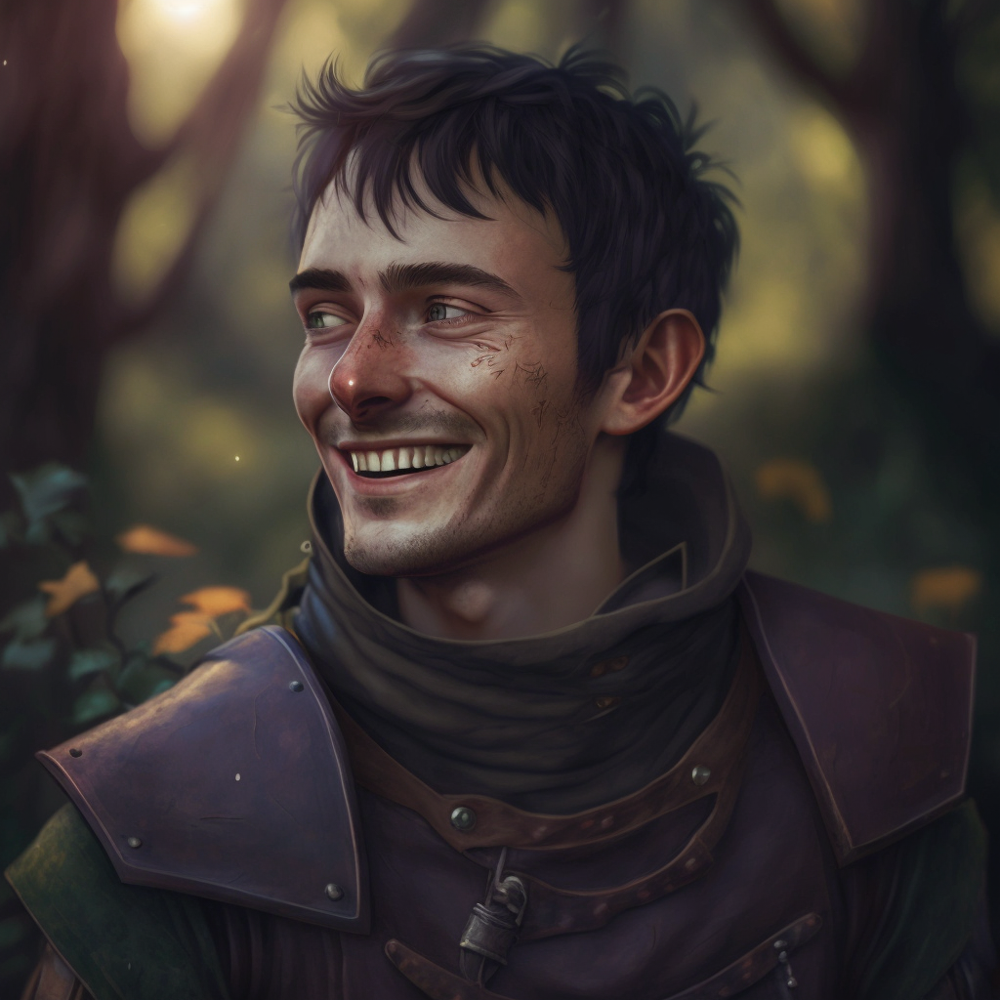

# Harold Bybet

- :octicons-info-24:{ .lg .middle } __Biographical Information__

    A [Sembaran](<../../gazetteer/greater-sembara/sembara/sembara.md>) [human](<../../species/humans/humans.md>) (he/him)  
    Born DR 1691 (29 years old)  
    { .bio }

{align="right"; width="320"}The cousin of [Arthur Bybet](<./arthur-bybet.md>) and husband of [Annet Bybet](<./annet-bybet.md>), he is a dear friend from childhood of [Rinault](<./rinault-essford.md>) and a keen hunter and horseman. He lives at [Essford Manor](<../../gazetteer/greater-sembara/sembara/barony-of-aveil/cleenseau-region/cleenseau/essford-manor.md>).

He seems skittish about actually helping, and despite his clear skill with a bow and ability to ride, he has somehow been scarce whenever military aid has been required.
