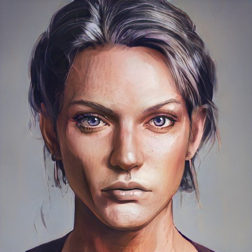

# Lady Rosalind Essford

- :octicons-info-24:{ .lg .middle } __Biographical Information__

    A [Sembaran](<../../gazetteer/greater-sembara/sembara/sembara.md>) [human](<../../species/humans/humans.md>) (she/her)  
    Born DR 1677 (43 years old)  
    Leader of the [Lord's Council of Cleenseau](<../../gazetteer/greater-sembara/sembara/barony-of-aveil/cleenseau-region/cleenseau/lord-s-council-of-cleenseau.md>)  
    Regent of [Cleenseau](<../../gazetteer/greater-sembara/sembara/barony-of-aveil/cleenseau-region/cleenseau/cleenseau.md>) (since March 15th, 1719)  
    { .bio }

    Based in [Cleenseau](<../../gazetteer/greater-sembara/sembara/barony-of-aveil/cleenseau-region/cleenseau/cleenseau.md>), the [Manor of Cleenseau](<../../gazetteer/greater-sembara/sembara/barony-of-aveil/cleenseau-region/manor-of-cleenseau.md>), the [Barony of Aveil](<../../gazetteer/greater-sembara/sembara/barony-of-aveil/barony-of-aveil.md>)

:octicons-location-24:{ .lg .middle } Currently travelling to [Embry](<../../gazetteer/greater-sembara/sembara/heartlands/embry.md>), in [Sembara](<../../gazetteer/greater-sembara/sembara/sembara.md>)

:octicons-location-24:{ .lg .middle } Seen by the [Heroes of Cleenseau](<../pcs/cleenseau/heroes-of-cleenseau.md>) on January 3rd, 1720 travelling to [Rinburg](<../../gazetteer/greater-sembara/sembara/barony-of-aveil/rinburg.md>), in the [Barony of Aveil](<../../gazetteer/greater-sembara/sembara/barony-of-aveil/barony-of-aveil.md>), [Sembara](<../../gazetteer/greater-sembara/sembara/sembara.md>)  

{align="right"; width="320"}The daughter of [Wymar](<./wymar-essford.md>), short, and with hair just beginning to grey, but forceful out of proportion to her size, and with a sharp intelligence to her eyes. Popular with the townspeople and said to be wise and fair. She married [Arthur Essford](<./arthur-essford.md>) in 1706, and their match has been a good and popular one. 

