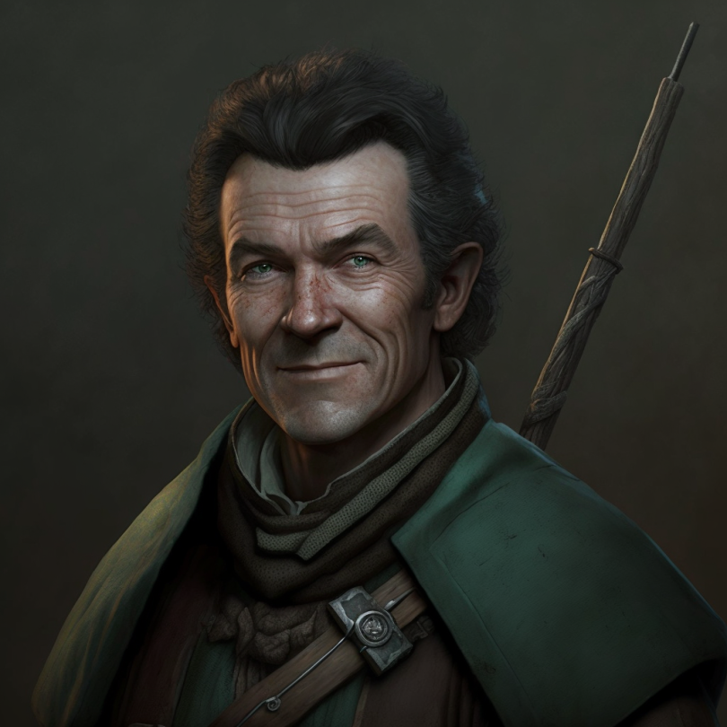

# Warin the Woodsman

- :octicons-info-24:{ .lg .middle } __Biographical Information__

    A [Sembaran](<../../gazetteer/greater-sembara/sembara/sembara.md>) [human](<../../species/humans/humans.md>) (he/him)  
    Born DR 1671 (49 years old)  
    { .bio }

    Based in [Valit](<../../gazetteer/greater-sembara/sembara/barony-of-aveil/cleenseau-region/valit.md>), the [Manor of Valit](<../../gazetteer/greater-sembara/sembara/barony-of-aveil/cleenseau-region/manor-of-valit.md>), the [Barony of Aveil](<../../gazetteer/greater-sembara/sembara/barony-of-aveil/barony-of-aveil.md>)

{align="right"; width="320"}A tracker and woodsman from [Valit](<../../gazetteer/greater-sembara/sembara/barony-of-aveil/cleenseau-region/valit.md>), and confidant of [Sabine de Brune](<./sabine-de-brune.md>).

He has helped the [Heroes of Cleenseau](<../pcs/cleenseau/heroes-of-cleenseau.md>) several times, both as a tracker in the forest hunting giant spiders, and as a a leader during the [Battle Against Wakog](<../../events/1700s/1719/12/battle-against-wakog.md>). He is skilled with a bow, but comes across as no-nonsense, all-business and never talks about his personal life.

