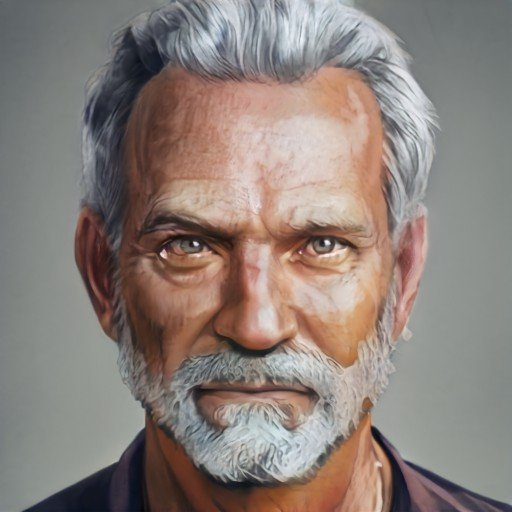

# Lord Wymar Essford
<div class="grid cards ext-narrow-margin ext-one-column" markdown>
- :octicons-info-24:{ .lg .middle } __Biographical Information__

    A Sembaran [human](<../../species/humans/humans.md>) (he/him), of Essords  
    b. DR 1652 - d. February 11th, 1720, died at age 68 years  
    Lord of Cleenseau (DR 1689 - February 11th, 1720)  
    { .bio }

    Lived in Cleenseau, the Manor of Cleenseau, the Barony of Aveil
</div>


:octicons-location-24:{ .lg .middle } Roused by the Heroes of Cleenseau on January 3rd, 1720 in Cleenseau, the Manor of Cleenseau, the Barony of Aveil  


The aging and senile lord of the manor in Cleenseau. The son of Reginald Essford and Celine Essford. He is rarely involved in the day to day events of the town. His children are Rosalind Essford and Rinault Essford. Since March 1719, he has been suffering from increasingly significant dementia and his daughter has largely taken over the management of Cleenseau. 

{width="320"}


>[!info] Childhood Story, as told to Viepuck under the influence of his patron's mind-probe
In his childhood, he recalled overhearing his parents (Reginald and Celine). Reginald was very drunk, and was weeping. Wymar recalls hearing his father sobbing to Celine: "I can't forget it. That day, the bodies just kept walking up out of the tower, just below us, and he was grinning even as we struck him down. Mother help me, I want to forget. Sometimes in my dreams I still see it. Was it wrong to build here? Is this place cursed?".


### Relationships
```dataviewjs
const { util } = customJS
dv.table(["Person", "Info", "Current Location", "Alive"], 
			dv.pages("#person or #organization or #item")
				.where(f => util.isLinkedToPerson(f.file, dv.current().file))
				.sort(f => util.s("<maintype:n>", f.file))
				.map(b => [util.s("<name> (<pronouns> <pronunciation>)", b.file), util.s("<ancestry> <maintype>", b.file), util.s("<lastknown:2> (<lastknowndate>)", b.file, dv.current().pageTargetDate), util.isAlive(b.file.frontmatter, dv.current().pageTargetDate)]))
```

