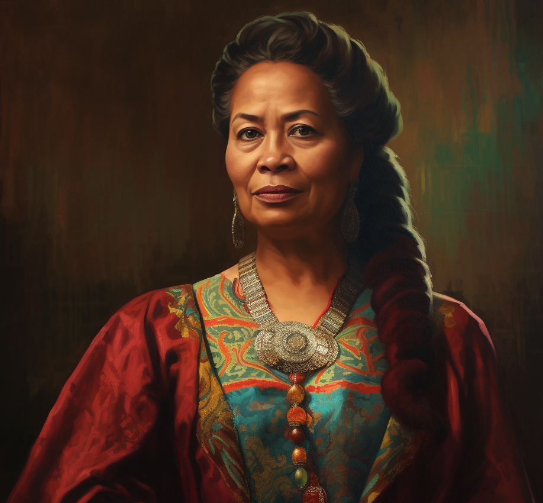

# Cecilia Lister

- :octicons-info-24:{ .lg .middle } __Biographical Information__

    A [Tollender](<../../gazetteer/western-green-sea/tollen/tollen.md>) [human](<../../species/humans/humans.md>) (she/her)  
    Born DR 1694 (26 years old)  
    Member of the [Dyer's Guild](<../../groups/tollen-guilds/dyer-s-guild.md>)  
    { .bio }

    Based in the [Free City of Tollen](<../../gazetteer/western-green-sea/tollen/tollen.md>)

An elegant older woman, very precise, who runs an unmarked but well-known tattoo parlor in Southbridge in [Tollen](<../../gazetteer/western-green-sea/tollen/tollen.md>). Important in the [Dyer's Guild](<../../groups/tollen-guilds/dyer-s-guild.md>), and rich. Extremely skilled in the arts of tattoos, especially magical tattoos made with enchanted dyes.

