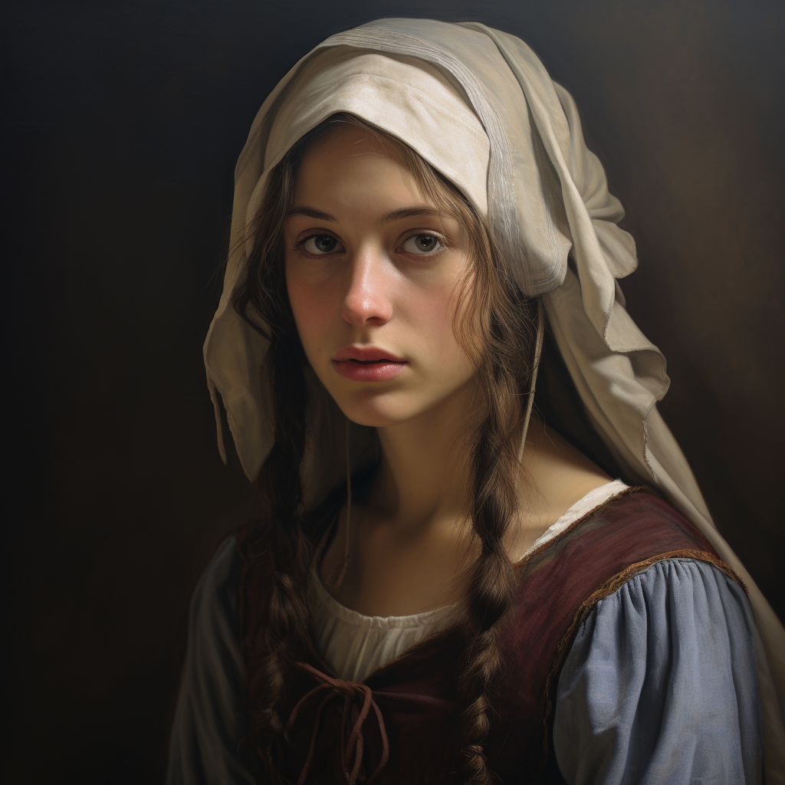

# Sarah de Grey

- :octicons-info-24:{ .lg .middle } __Biographical Information__

    An [Isinguer](<../../history/istabor-alliance.md>) [human](<../../species/children-of-divine-creation/humans/humans.md>) (she/her)  
    **(page is future dated)**  
    { .bio }

{align="right"; width="320"}Sarah de Grey, a 16-year-old from the distinguished Isinguer family, is a student at the [University of Tollen](<../../gazetteer/western-green-sea/tollen/university-of-tollen.md>). Originally from the [Duchy of Maseau](<../../gazetteer/greater-sembara/duchy-of-maseau/duchy-of-maseau.md>) in the south, she has come to [Tollen](<../../gazetteer/western-green-sea/tollen/tollen.md>) to study, and has developed connections to the Insinguer community in the city, especially [Guy Marchand](<./guy-marchand.md>).  

