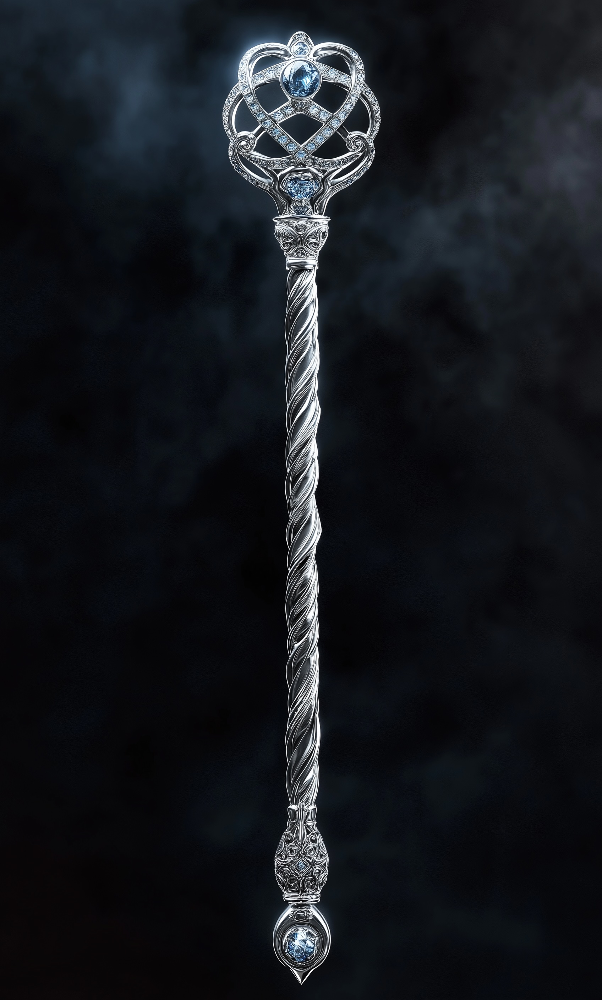

# The Scepter of Command

- :octicons-info-24:{ .lg .middle } __Unique Scepter__  
   Created DR 1053 (667 years ago)  
   Created by [Emperor Apollyon](<../../people/historical-figures/drankorian-emperors/apollyon.md>)  

:octicons-location-24:{ .lg .middle } Owned in [Kharsan](<../../gazetteer/greater-dunmar/dunmari-basin/kharsan.md>), the [Garamjala Desert](<../../gazetteer/greater-dunmar/garamjala-plateau/garamjala-desert.md>), the [Desolation of Cha'mutte](<../../gazetteer/istaros-watershed/desolation-of-cha-mutte.md>)

{align="right"; width="300"}

This scepter is about a foot long and is constructed in silver, with loops of silver forming a ball at the head, set with diamonds that seem to catch the light. It feels very old, and yet doesn't seem tarnished or worn at all. 

It seems powerful, and like it wants to be used.

## Destruction
The Scepter of Command was destroyed in 1748, by [Dunmar Fellowship](<../../people/pcs/dunmar-fellowship/dunmar-fellowship.md>). It was immersed in the sacred waters on the island of [Vetta](<../../gazetteer/western-green-sea/skaerhem/vetta.md>) in the Skaer Islands for 24 hours during a full moon, and then shattered with the combined power of [Kenzo](<../../people/pcs/dunmar-fellowship/kenzo.md>)'s staff and the might of [Kaikkea](<../../cosmology/gods/incorporeal-gods/kaikkea.md>)'s waters. 

